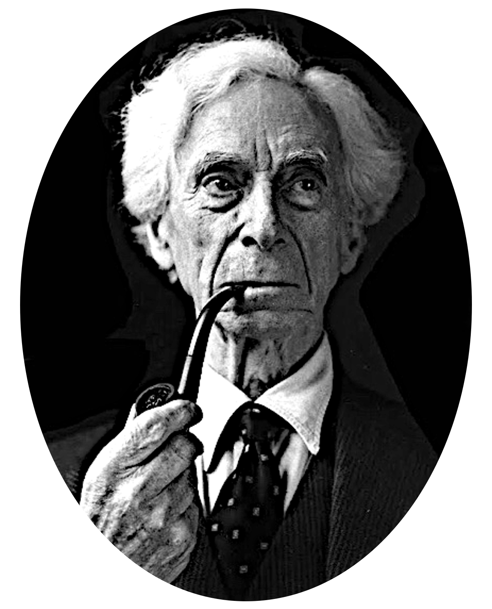

### Bertrand Russell
# WARTOŚĆ WOLNEJ MYŚLI
#### 1944

_Esej Bertranda Russella zatytułowany "The Value of Free Thought" (Wartość wolnej myśli) został opublikowany w 1944 roku. Esej ten jest częścią zbioru esejów Russella pod tytułem "Human Knowledge: Its Scope and Limits" (Ludzka wiedza: jej zakres i ograniczenia), w którym Russell bada kwestie związane z wiedzą, sceptycyzmem, metodami naukowymi i wartością niezależnego myślenia.
Russell, jako filozof, matematyk i laureat Nagrody Nobla, był znanym orędownikiem wolności intelektualnej, racjonalizmu i sceptycyzmu naukowego. W swoich pracach często podkreślał znaczenie niezależnego myślenia i krytycznego podejścia do tradycji, autorytetu oraz ustalonych wierzeń. Esej "Wartość wolnej myśli" jest jednym z przykładów jego poglądów na te tematy._

---

Wyrażenia „wolna myśl” używa się najczęściej dla wskazania myśli, która przeciwstawia się jakiejś dominującej ortodoksji. Ale taka opozycyjność to tylko przejaw wolności myśli — częsty, ale niekonieczny. „Wolna myśl” oznacza myślenie w sposób wolny, przynajmniej wolny do tego stopnia, jaki leży w możliwościach ludzkiej istoty. Człowiek wolny to taki, który jest wolny od czegoś: od czegóż więc wolny jest wolnomyśliciel? Aby zasłużyć na to miano, musi być wolny od dwóch rzeczy: od ciężaru tradycji i tyranii własnych upodobań. Nikt nie może całkowicie się od nich uwolnić, ale istnieje osiągalny dla człowieka stopień emancypacji, który może zeń zrobić istotę zasługującą na imię wolnomyśliciela. Nie wolno odmawiać tego tytułu osobie, której zdarzyło się mieć w jakiejś sprawie takie samo zdanie, jakie głoszą naczelni teologowie jego kraju. Jeżeli Arab wychodząc od pierwszych zasad rozumu ludzkiego zdoła wydedukować, że Koran nie został stworzony, ale istniał odwiecznie w niebiesiech, może być uważany za wolnomyśliciela, jeśli zechce wysłuchać argumentów przeciwstawnych i poddać swoje rozumowanie krytycznemu zbadaniu. Podobnie i Europejczyk, który opierając się na definicji miłosierdzia potrafi udowodnić, że Bóg okazuje swe najwyższe miłosierdzie skazując swym wyrokiem niemowlęta na wieczne potępienie, jeżeli zdarzy się im umrzeć, zanim kto spryska je wodą w takt pewnych magicznych zaklęć, będzie uważany za przedmiot spełniający naszą definicję. Myśliciela czynią wolnym nie jego przekonania, ale sposób, w jaki je żywi. Jeżeli żywi je, ponieważ starsi powiedzieli mu, gdy był młody, że są prawdziwe, albo dlatego że gdyby ich nie miał, to byłby nieszczęśliwy, jego myśl nie jest wolna. Ale jeżeli czyni to, ponieważ po dokładnym rozważeniu znajduje, że większość znanych mu faktów świadczy na rzecz jego przekonań, to jego myśl jest wolna bez względu na to, jak niezwykłe mogą być same te przekonania.  

Wolność od tyranii swych upodobań jest równie ważna jak wolność od wpływów tradycji. Pomyleniec, który uważa, że jest bogiem albo dyrektorem Bank of England, nie jest wolnym myślicielem, ponieważ zezwolił, aby megalomania zapanowała nad jego rozsądkiem. Zazdrosny mąż, który podejrzewa żonę o niewierność nie mając po temu dostatecznych powodów, tak samo jak zadowolony z siebie optymista, któremu podejrzenie nie przychodzi do głowy, choć żona dostarcza aż nadto dowodów na to, obaj zezwolili uczuciu, aby zniewoliło ich myśl. Zatem myśl żadnego z nich nie jest wolna.  

Wolność, jakiej poszukuje wolnomyśliciel, nie jest absolutną, anarchiczną wolnością: jest to wolność w ramach intelektualnego prawa. Nie będzie ulegać autorytetowi innych ani swoim własnym pragnieniom, ale podporządkuje się dowodom. Udowodnij mu, że jest w błędzie, a zmieni swój pogląd; dostarcz mu nowych świadectw, a on, jeżeli okaże się to konieczne, odrzuci nawet najbardziej ulubione teorie. Takie postępowanie nie jest dlań niewolą, ponieważ pragnie wiedzieć, a nie ulegać pustym fantazjom. Pragnienie wiedzy zawiera jakiś element pokory wobec faktów; w sferze poglądów oznacza to pokorę wobec wszechświata. Ale nie oznacza to pokory wobec ludzkości: wolnomyśliciel nie uzna za wiedzę prawdziwą tej fałszywej monety, jaką chce się nam zazwyczaj nachalnie wetknąć w całym majestacie autorytetu. Wolnomyśliciel wie, że aby panować nad swym otoczeniem, musi je rozumieć. I że złudzenie potęgi biorące się z fantazji mitów nie jest ani na jotę lepsze od iluzji chełpliwego pijaczka. Wolnomyślicielowi potrzebna jest niezależność od swych bliźnich, od własnych przesądów — trudna samodyscyplina; a wobec świata, który pragnie zrozumieć, potrzebne mu jest czyste, niezmącone spojrzenie, by mógł widzieć bez zakłóceń.  

Czy wolnomyśliciel, taki ktoś, jakżeśmy go tutaj opisali, jest pożądanym członkiem społeczności, czy też jest zagrożeniem dla tego, co wszyscy uważamy zazwyczaj za święte? Niemal we wszystkich epokach i wszystkich regionach świata panuje przekonanie, że jest on groźbą. Takie same poglądy panują zresztą do tej pory w różnym stopniu w każdym prawie kraju. W Niemczech zamyka się takiego do obozu koncentracyjnego, w Rosji wysyła do arktycznego obozu pracy, w Japonii więzi za „niebezpieczne myśli”, w Stanach Zjednoczonych, chociaż tam nie podlega karze przewidzianej w kodeksie karnym, zabrania mu się zawodu nauczycielskiego w większości szkół i uniwersytetów oraz odbiera wszelką szansę i nadzieję na karierę polityczną. Przez cały okres około tysiąca dwustu lat każdy chrześcijański kraj w Europie skazywał regularnie wolnomyślicieli na spalenie na stosie. W krajach muzułmańskich, choć często popierani przez monarchów, wolnomyśliciele byli przedmiotem nienawiści tłumu nawet w okresach największego rozkwitu kultury arabskiej i mauretańskiej. Tak częsta, niemal powszechna, wrogość ma zapewne głębokie korzenie. Tkwią one częściowo w naturze ludzkiej, częściowo w strukturze władzy państwowej klik rządzących; w obu przypadkach glebą, na której korzenie te się rozwijają, jest strach.
Rozważmy parę argumentów przeciwko wolnej myśli, używanych przez ludzi, którzy nie zadowalają się prostackim odwołaniem do autorytetu panujących przesądów. 
Najpierw mamy apel o skromność. Nim lubią się posługiwać zwłaszcza ludzie starzy, starając się poskromić rebelianctwo młodości. Przez całe wieki wszyscy ludzie mądrzy, słyszymy, zgadzali się na wierność pewnym wielkim prawdom, a kimże, na litość boską, ty jesteś, aby podnosić rękę przeciwko ich jednomyślnemu świadectwu? Jeżeliś gotów odrzucić nauki św. Pawła i św. Augustyna, to może poważysz się także na Platona i Arystotelesa? Albo, co gorsza, jeśli masz w pogardzie wszystkich starożytnych, to cóż powiesz o Kartezjuszu i Spinozie albo Kancie i Heglu? Czyż ci dostojni mężowie nie byli ludźmi światłymi? Czyż nie zbadali spraw ludzkich i boskich daleko głębiej, aniżeli ty możesz mieć nadzieję to uczynić? A czy wielebny pasterz Kościoła twych rodziców, pastor naszej parafii, nie jest mężem uczonym i cnotliwym? Ma przecież tytuł teologa, a nawet spędził kilka miesięcy na nauce hebrajskiego! A może zapomniałeś, co Bacon, ten dobry i światły człek, zwykł mawiać o małej wiedzy, który skłania się ku ateizmowi? Zali śmiesz sądzić, że nie ma takich tajemnic, przed którymi ludzki rozum musi się ukorzyć? Zuchwalstwo rozumu jest grzechem, a ty, nieszczęsny, popełniasz go stawiając swój sąd przeciwko wiedzy najmędrszych ludzi wielu wieków.  

Ten argument, wyrażony po łacinie, a jak wiadomo w tym języku każdy nonsens brzmi dostojnie, został podniesiony przez Kościół katolicki do rangi pierwszej zasady: nie myli się ten, co wierzy w to, w co wierzył każdy, zawsze i wszędzie. Tym, którzy posługują się owym argumentem, wygodnie jest zapominać, jak wiele prawd, kiedyś powszechnie wyznawanych, teraz jest w zapomnieniu. Kiedyś sądzono, że na antypodach ludzie mieszkać nie mogą, bo byliby pospadali albo od stania do góry nogami rośliby w monstrualny sposób. Kiedyś każdy myślał, że Słońce krąży wokół Ziemi, że jednorożce istnieją, że ropuchy mają trujący jad. Do XVI wieku nikt nie kwestionował skuteczności zabiegów magicznych. Pierwsi, którzy zwątpili w prawdziwość tego przesądu, spłonęli na stosie — i wcale nie było ich mało. Kto teraz akceptuje doktrynę, kiedyś niemal powszechną w całym chrześcijaństwie, że niemowlęta, które umrą bez chrztu, spędzą całą wieczność w piekle, ponieważ Adam zjadł jabłko? Wszystkie jednak te — teraz zapomniane — teorie były kiedyś wyznawane dzięki powoływaniu się na mądrość wieków.  

Powołanie się na autorytet jest argumentem zawodnym, ale gdyby go nawet uznać, to nie jest pewne, czy bardziej świadczyłby on na korzyść chrześcijaństwa, czy przeciw niemu. Znaczną część życia spędziłem wśród pisarzy i ludzi nauki. Wolność myśli wśród nich uważa się za coś naturalnego, a nieliczne wyjątki uchodzą za wybryk albo fantazję. Jest prawdą również, że większość tego rodzaju ludzi posiada dość mądrości życiowej, żeby nie głosić swych poglądów wobec ortodoksji. Nawet bowiem znany wolnomyśliciel jest narażony na wiele różnorakich przykrości i napotyka znacznie więcej trudności w ułożeniu sobie życia niż człowiek, któremu gładko przyszło przełknąć nauki jakiego bądź Kościoła. Tylko właśnie dzięki tej ich hipokryzji ludzie wierzący mogą ciągle jeszcze bez przeszkód oszukiwać młodzież, potrząsając nad jej głową autorytetem.  

Studia antropologiczne pomogą nam zilustrować tę sprawę. Stwierdzono, że dzicy w całym Świecie na pewnym etapie rozwoju posiadają bardzo podobne wierzenia, które nowoczesnej umysłowości niemal zawsze wydają się bezsensowne. Ale jeśli uznamy, że ludzkość stale się rozwija, to za 20000 lat od tej chwili nie będziemy w oczach swych potomków jakoś się specjalnie odróżniać od dzikich, z którymi porównanie napawa nas obecnie takim poczuciem wyższości. Przyjęło się datować epoki antropologiczne za pomocą używanego w nich materiału: epoka kamienia, epoka brązu, epoka żelaza. Przez analogię do tego zwyczaju można również nazywać kultury wskazując na dominujące w nich poglądy: kultura kanibalistyczna, kultura ofiar zwierzęcych, kultura transsubstancjacji, i tak dalej w przyszłość. To bardzo zdrowo ujrzeć własne wierzenia jako jeden z etapów tego rozwoju. Widać od razu, że nie ma nic takiego, co wyznawałby „każdy, zawsze i wszędzie”. Widać również i to, że jeśli w coś wierzyli wszyscy w danej epoce kulturowej, to w następnej wszyscy mieli to za nonsens.  

Mądrość wieków, na którą lubią się powoływać ugodowcy i ortodoksi, jest mitem. Istnieje tylko „mądrość jakiegoś czasu i miejsca. Gdziekolwiek i kiedykolwiek się znajdziesz, a chcesz, aby dobrze myśleli o tobie wpływowi obywatele, musisz przynajmniej z pozoru dzielić z nimi ich ulubione przesądy i zapomnieć, że wpływowi obywatele zamieszkujący gdzie indziej i kiedy indziej mają upodobanie do zupełnie innych przesądów. Jeśli jednak chcesz zdobywać wiedzę, musisz machnąć ręką na wszystkich wpływowych obywateli i polegać na własnym sądzie, nawet gdy cenisz autorytet ludzi, którzy szanują twoje własne zdanie. Ten stopień zaufania do siebie jest pierwszym krokiem ku wolności myślenia. Nie, żebyś miał się uważać za nieomylnego; musisz jednak nauczyć się myśleć, że każdy jest omylny i zadowalać się mniejszym lub większym prawdopodobieństwem, takim jakie zapewnić może doświadczenie. To odrzucenie absolutnej pewności jest dla niektórych umysłów najtrudniejszym krokiem ku wolności myślenia.  

Spośród argumentów używanych do wykazania, że wolna myśl jest grzeszna i nikczemna, najpopularniejszy jest ten, że bez religii ludzie nie potrafiliby żyć w cnocie i poszanowaniu dobra. Dobroć w człowieku upadłaby, brzmi dowód, z dwóch powodów: najpierw dlatego, że przestałby odczuwać strach przed karą, a po drugie dlatego, że utraciłby zdolność rozróżnienia tego, co jest cnotą, a co grzechem. Ortodoksja katolicka w posługiwaniu się tym argumentem zdobyła pewną przewagę nad protestantyzmem. Zobaczmy, jak wygląda on z katolickiego punktu widzenia.  

Teologia grzechu zawsze była dosyć powikłana, ponieważ musiała stawić czoło fundamentalnemu zagadnieniu: dlaczego Bóg dopuścił grzech? Św. Augustyn twierdził, że od momentu zjedzenia jabłka przez Adama ludzie utracili wolną wolę; nie mogli się już swoim własnym wysiłkiem powstrzymać od grzechu. A ponieważ grzech zasługuje na karę, byłoby ze strony Boga zupełnie sprawiedliwe, gdyby posłał cały rodzaj ludzki do piekła. Ale miłosierdzie jest również cnotą — i właśnie po to, aby przejawić tę cnotę, Bóg musiał posłać pewną część ludzkiego rodu do nieba. Tylko zwykły kaprys, jak utrzymywał św. Augustyn, kierował Nim, gdy dzielił rodzaj ludzki na wybranych i potępionych. Ale na wybranych, gdy zechciał ich wskazać, zesłał łaskę, dzięki której potrafią oni, oczywiście w jakichś dostępnych człowiekowi granicach, trzymać się z dala od grzechu. Ci są cnotliwi, bo są zbawieni, a nie dlatego zbawieni, że cnotliwi. Z pewnych niejasnych powodów łaski nie udało się zesłać na nie chrzczonych.  

Współczesnym św. Augustyna był pewien dobry Walijczyk nazwiskiem Morgan, który przetłumaczył swe miano na Pelagiusz i zwalczał teorie św. Augustyna jako zbyt okrutne. Utrzymywał, że mimo iż Adam zgrzeszył, ludzie nadal posiadają wolną wolę. Dopuszczał nawet możliwość, aby istota ludzka była w niektórych przypadkach całkowicie wolna od grzechu. Wierzył, że źli ludzie będą potępieni, ponieważ grzeszą, podczas gdy św. Augustyn głosił, że grzeszą, bo są potępieni. Pelagiusz twierdził, że we władzy każdego człowieka jest żyć dobrze, aby zasłużyć sobie na niebo, i że kwestia zbawienia albo potępienia zależy od tego, jaki pożytek czyni on ze swej własnej wolnej woli. Autorytet św. Augustyna spowodował, że teoria ta została potępiona i pozostała herezją aż do reformacji. W okresie reformacji Luter i Kalwin z takim zapałem zaczęli jednak głosić augustyńską teorię o predestynacji, że Kościół katolicki bez jakichś formalnych postanowień począł coraz bardziej chylić się ku doktrynie Pelagiusza. Pelagianizm obecnie jest, w praktyce przynajmniej, jeśli nie w teorii, wyznawany nie tylko przez Kościół katolicki, ale również przez znakomitą większość protestantów. Za tym ustępstwem poszły dalsze i okazało się, że do piekła pójdzie znacznie mniej ludzi, niż wynikało z wcześniejszych obliczeń. Właściwie wśród protestantów całkowite odrzucenie piekieł stało się bardzo powszechne.  

Mogłoby się zdawać, że wiara zarówno w piekło, jak i czyściec powinna była wielce sprzyjać upowszechnieniu tego, co teologowie uważają za cnotę. Jeśli się przyjmie doktrynę św. Augustyna, wypada stwierdzić, że aczkolwiek to nie cnocie zawdzięczamy wędrówkę do nieba, to jednak cnota jest oznaką wybranych. Jeśli wiedziesz żywot nikczemny, będziesz musiał przyznać, żeś jest wśród potępionych. Będziesz żył zatem cnotliwie mając nadzieję, że oznacza to zaliczenie do grona wybranych do nieba. Jeśli przyjmujesz pospolitszy pogląd, że za twoje grzechy spadnie na ciebie kara polegająca na spędzeniu wieczności w piekle czy też krótszego lub dłuższego okresu w ogniach czyśćcowych, to jeśli jesteś szlachetny, wziąwszy pod uwagę wszystkie za i przeciw uznasz, że dobrzy zyskują więcej przyjemności niż grzeszni i dlatego, jako racjonalnemu hedoniście, wyjdzie ci z rachunku, że lepiej jest powstrzymywać się od grzechu. Jeśli jednak nie wierzysz w życie po śmierci, to będziesz grzeszył bez opamiętania przy każdej nadarzającej się okazji, przy której nie trzeba się obawiać kary ziemskiej. Tak przynajmniej myślą teologowie. Czy bierze się to z samoobserwacji, czy może z jakichś innych powodów — nie wiadomo, ale wszyscy teologowie wydają się zgodni, że cnota bez nadziei na zysk nie jest możliwa.  

Bez względu jednak na to, jak się ma rzecz z teologami, uznano, że poglądy na grzech panujące we wczesnym Kościele są zbyt surowe dla zwykłej istoty ludzkiej i łagodzono je na różne sposoby, które — rzecz ciekawa — każdorazowo zwiększały potęgę kapłaństwa. Sakrament odpuszczenia chroni grzeszników przed najwyższym wymiarem kary, potępieniem: wolno takiemu popełniać wszystkie grzechy, jakie mu tylko przyjdą na myśl, jeśli dokona na łożu śmierci aktu skruchy i otrzyma ostatnie namaszczenie. Prawda, że w tym przypadku może być niezbędne spędzenie jakiegoś okresu w czyśćcu, ale pobyt tam można w poważny sposób skrócić, jeśli odprawi się mszę za grzeszną duszę, a żaden ksiądz nie odmówi, jeśli otrzyma pieniądze na ten cel. Tak więc potęga bogactwa rozciąga się poza grób, a łapówkarstwo jest skuteczne nawet w niebie. Ta przyjemna teoria dała bogatym wolność pobłażania swym upodobaniom, jak tylko uważali to za stosowne. W wiekach wiary mord i gwałt były powszedniejsze aniżeli kiedykolwiek później. Historia nie potwierdziła rzekomej skuteczności wiary ortodoksyjnej w okiełznaniu grzechu. Nie tylko wierzący ulegali grzechowi, ale niewierni często okazywali się wyjątkowo czcigodni. Trudno wskazać jakąkolwiek gromadę ludzi bardziej nieskazitelnych od rzetelnych myślicieli XIX wieku.  

Ale — mistrz ortodoksji zaprotestuje — jeśli zdarza się wolnomyślicielowi być szlachetnym, to tylko dzięki temu, iż żyje on we wspólnocie chrześcijańskiej i wchłonął jej etykę w młodości. Gdyby nie ten wpływ, byłby odrzucał prawo moralne i nie mógł się powstrzymać od wszelkiej infamii. Mówi się, że grzechy nazistów i bolszewików to owoc wolnomyślicielstwa. Ale według naszej definicji nie są oni wolnomyślicielami; są fanatycznymi zwolennikami absurdalnych dogmatów, a ich grzech bierze się właśnie z fanatyzmu. Ich grzechy są w istocie tego samego rodzaju co okrucieństwa takich bohaterów, jak Karol V czy Filip II, którzy byli żarliwymi wyznawcami religii. Karol V spędziwszy dzień na pustoszeniu pewnego protestanckiego. miasta uczuł w pewnej chwili, że zasłużył na chwilę rozrywki: wysłał swe sługi, aby mu znaleźli dziewicę i przywiedli doń. Wierni słudzy znaleźli dziewicę lat siedemnastu. Dziewczyna dostała zapewne trypra, ale cesarz nie miał chyba kłopotów z uzyskaniem odpuszczenia. Taki system ma powstrzymywać ludzi od grzechu.  

Z drugiej strony wielu tych, którzy mają teraz opinię ludzi wyjątkowo dobrych, musiało znosić potwarze — jeśli nie gorzej — za to, że sprzeciwiali się panującej za ich czasów ortodoksji. Sokrates na podstawie sfałszowanych dowodów jego bezbożnictwa został skazany na wypicie cykuty. Inkwizycja spaliła Giordana Bruna, a Kalwin spalił Servette'a ponieważ, choć ze świecą szukać szlachetniejszych od nich, popadli w herezję. Spinoza, jeden z najlepszych ludzi znanych historii, został ekskomunikowany przez Żydów i przeklęty przez chrześcijan; przez sto lat po jego śmierci mało kto odważył się powiedzieć o nim dobre słowo. Wolnomyśliciele angielscy i amerykańscy wieku XVIII i początków XIX, to w większości wypadków ludzie najwyższej miary moralnej; w niektórych przypadkach ortodoksja była zmuszona ukrywać fakt, iż tak bardzo podziwiani i powszechnie kochani ludzie jak Ojcowie Założyciele _(1)_ głosili szokujące poglądy. W naszych czasach wolna myśl ciągle sprowadza na ludzi kłopoty, w mniejszym stopniu z powodu krytyki dogmatów, częściej z powodu krytyki moralności opartej na przesądach religijnych.  

_(1) Ojcowie Założyciele (Founding Fathers), tj. ojcowie państwowości i niezależności Stanów Zjednoczonych Ameryki Północnej; byli wśród nich George Washington, Benjamin Franklin, Thomas Jefferson, John Adams i James Madison._

Istnieją pewne czyny nazywane „grzechem”, co do których zachodzi przypuszczenie, że biorą się z wolnomyślicielstwa. Gdy Żyd przestaje być ortodoksyjny, może jeść wieprzowinę. Hinduista popełnia występek jedząc wołowinę. W ortodoksyjnym Kościele greckim za grzech uchodzi małżeństwo rodziców chrzestnych tego samego dziecka. Nie zaprzeczam, że wolna myśl może mieć wpływ na upowszechnianie się potworności tego rodzaju. Protestanci potępiają sobotnie zabawy, katolicy potępiają kontrolę urodzeń. Również i w tych kwestiach wolna myśl może zaszkodzić temu, co bigoteria uważa za dobre. Irracjonalne kodeksy moralne, które nie mają oparcia w niczym poza samym przesądem, nie zdołają przetrwać dłużej niż nawyk uczciwego myślenia. Ale jeżeli moralny kodeks sprzyja dobru ludzkiemu w tej ziemskiej wędrówce, to nie potrzebuje żadnych nadnaturalnych sankcji. Życzliwość i rozumność to główne motywy pożytecznego zachowania ludzi i żadna z nich nie będzie się rozwijać, gdy zmusza się ich wbrew wszelkiemu rozsądkowi do wiary w kapryśne i mściwe bóstwo, którego okrucieństwo w ścisłym, matematycznym sensie nieskończenie prześciga okrucieństwo najpodlejszej ludzkiej istoty, jaka kiedykolwiek istniała. Nowocześni liberalni chrześcijanie zaprotestują, że nie jest to Bóg, w którego oni wierzą, ale powinni pamiętać, że tylko dzięki naukom prześladowanych wolnomyślicieli dokonał się moralny postęp w ich wyznaniu.  

Przechodzę teraz do klasy argumentów przeciwko wolnej myśli, które można nazwać politycznymi. W dawniejszych czasach argumenty te przybierały bardzo niewyrafinowaną postać: to bardzo dobrze — mówiło się — być sceptykiem, jeśli się jest bogatym i potężnym. Ale biedni muszą mieć nieco jakiejś wiary, która niosłaby im pocieszenie w ich losie. Jeśli można sprawić, aby uwierzyli, że pełne strapień i mąk życie doczesne jest tylko krótkim wstępem do wiecznej rozkoszy i że jest bardziej prawdopodobne, iż ta nagroda przypadnie raczej ubogim niż bogatym, to będą mniej podatni na wywrotową propagandę, zwłaszcza, gdy niebo przedstawi się jako nagrodę tylko dla posłusznych. Ten punkt widzenia znany był już w starożytności, przetrwał całe wieki średnie, ale przeważał zwłaszcza w początkach XIX wieku, kiedy krzewienie metodyzmu służyło pacyfikacji nastrojów wśród ofiar potwornego systemu przemysłowego w Anglii. Obecnie tak jawna obrona ziemskiej krzywdy jako karty wstępu do niebieskiej sprawiedliwości wyszła już z użycia, ale nie nastąpiło to jednak z inicjatywy bohaterów religii. Stało się to głównie dzięki takim wolnomyślicielom jak Tom Paine, Robert Owen i Karol Marks. Nie kto inny jak właśnie oni zawstydzili zarozumiałych ortodoksyjnych posiadaczy, którym się już zaczęło wydawać, że Boga można traktować jako Najwyższego Kapitalistę.  

Znana jest jednak uogólniona postać tego argumentu, która zasługuje na więcej szacunku i wymaga poważniejszego omówienia. W jednej ze swych form rzeczony argument głosi, że jedność społeczna niezbędna do przetrwania każdej grupy społecznej jest możliwa tylko dzięki jakiejś wspólnej wierze lub kodeksowi moralnemu i że żadna taka wiara czy kodeks nie może długo znosić niszczącego działania krytycznego sceptycyzmu. Były nawet epoki — brzmi argument dalej — gdy odrzucanie tradycyjnych, ortodoksyjnych poglądów powodowało katastrofy polityczne. Jako przykłady takich katastrof wymienia się wielki okres klasyczny w Grecji i epokę włoskiego Odrodzenia. Mniej światli obrońcy tradycji zazwyczaj wyciągają w tym kontekście upadek Rzymu i łączą go z podłościami Nerona. Ale jako że upadek Rzymu nie nastąpił przed upływem czterystu lat od śmierci Nerona, a Rzymianie w tym czasie zdołali przejść wielką odnowę moralną, której kulminacją było przyjęcie chrześcijaństwa, przykład ten należy do chybionych. Dwa pozostałe zasługują na poważniejsze rozpatrzenie.  

Greckim miastom odebrali niepodległość najpierw Macedończycy, a potem, trochę gruntowniej, Rzymianie, a stało się to w czasie, gdy starożytna „dewocja skapitulowała wobec wolnej myśli. Ale nie ma żadnego powodu, aby wiązać 'upadek Greków z ich sceptycyzmem. Ich miasta upadły, ponieważ Grecy nie potrafili się zjednoczyć, niemożność pojednania wynikła zaś ze zwykłych powodów politycznych, takich samych, które w naszych czasach uniemożliwiły pomniejszym państwom neutralnym zjednoczyć się przeciw Hitlerowi. Nawet najgorętsza wiara religijna nie mogłaby ich uratować. Jaki taki pożytek przynieść by mogła tylko wyjątkowa mądrość polityczna. Kartagina również upadła mimo tego, że podczas kryzysu Kartagenowie składali w ofierze Molochowi własne dzieci z pobożnością, która zadowoliłaby najbardziej wymagającego dogmatyka.  

Bardzo podobnie rzeczy się miały z włoskim Odrodzeniem. Francja i Hiszpania były wielkimi potęgami, którym małe państewka włoskie nie mogły się skutecznie przeciwstawić. Jak zawsze w takich wypadkach wzajemne wrogości utrudniały osiągnięcie jedności. Najgorętszym jej zwolennikiem był ten łajdak Machiavelli, a największym jej przeciwnikiem, jak sam tego dowiódł, był papież. Żaden poważny historyk nie ośmieli się powiedzieć, że wina za upadek Włoch spada na brak religijności. W jednej rzeczy możemy zgodzić się z tymi, co kładą nacisk na społeczną niezbędność religii. Tam gdzie Kościół stanowi bardzo prężną organizację i odgrywa znaczącą rolę w kierowaniu życiem ludzkim, jego gwałtowny rozpad mógłby pozostawić masy bez zewnętrznych wskazań i spowodować społeczny chaos do czasu powstania nowych, alternatywnych organizacji. Ale pod tym względem Kościół nie jest żadnym wyjątkiem i niczym się nie różni od innych ważkich organizacji. Ład społeczny jest ważny, a Kościół zawsze stanowił jeden ze sposobów jego zapewnienia, istnieje jednak na to niezliczona ilość innych sposobów, które nie pociągają za sobą aż tak wielkiej ceny umysłowego skrępowania.  

Niektórzy mówią, że problem prawdziwości czy fałszywości dogmatów religijnych jest nieistotny; że ważne jest to, czy przekonania takie przynoszą zadowolenie. Jakże moglibyśmy stawić czoło światu, pytają, gdyby poza tym padołem nie istniał lepszy świat i gdybyśmy nie mieli pewności, że pozorne zło tutaj służy jakiemuś większemu i dobremu celowi? Czyż wiara w nieśmiertelność nie daje odwagi w obliczu śmierci? Czy wiara w to, że bieg historii podlega wyrokom wszechwiedzącej miłosiernej Opatrzności nie pomaga nam wytrwać, gdy zło tryumfuje? Po cóż mamy sobie i innym odbierać to źródło szczęścia, dając wiarę podejrzanym argumentom tych, którzy nie chcą uwierzyć w nic, czego nie dowiódł chłodny rozum? Czyż serce nie ma swych praw? Czy musi podlegać rozumowi? Jak poeta Tennyson wykrzykuje, odpierając roszczenia sceptyków:  

_Na to Serce, jak człowiek w gniewie,  
Zerwało się i — Czuję! — odrzekło._

Na mój gust jest w tym punkcie widzenia coś z małoduszności i zasmarkanej beksowatości, co odbiera mi zupełnie cierpliwość niezbędną do jego omówienia. Odmowa stanięcia z odkrytą twarzą wobec faktów, bo są nieprzyjemne, uchodzi zazwyczaj za oznakę słabości charakteru, ale w dziedzinie religii ma być z jakichś powodów inaczej. Nie mogę pojąć, dlaczego jest czymś złym poddawanie się tyranii strachu we wszystkich sprawach ziemskich, ale szlachetnym i dobrym, gdy idzie o sprawy boskie i przyszłe życie.
Obrońcy ortodoksji mogą się sprzeciwić powiadając, że przecież nie jest wiadome, iż prawdy religii są nieprawdziwe. Jeżeli wszystko jest wątpliwe, dlaczego nie mielibyśmy wierzyć w trochę weselszą wersję świata? Tak argumentuje William James w książce Will to Believe (Wola wiary). Obowiązek wierności wobec prawdy, mówi tam, składa się z dwóch rzeczy: pierwsza polega na tym, aby wierzyć w to, co jest prawdziwe; druga na tym, aby nie wierzyć w to, co fałszywe. Obu tym zasadom przyznaje równą ważność. Sceptyk, który powstrzymuje się od wydania osądu, ponieważ brakuje mu potrzebnych, jak mówi, informacji, z całą pewnością postępuje źle, nie czyni bowiem tego, co powinien. Powinien przecież wierzyć w to, co prawdziwe. Gdyby więc zechciał uwierzyć w cokolwiek, jego udziałem mogłaby się stać wiara w to, co prawdziwe. Na takich podstawach w imię prawdy William James potępia sceptyka.  

Zdumiewa sofistyka tego argumentu. Wierność prawdzie nie polega na przyjmowaniu na wiarę wszystkiego, co się nawinie, na wypadek, gdyby się okazało, że to prawda. Nikt ani na moment nie przyjmuje takiego punktu widzenia w życiu, chyba że idzie o sprawy religii. Przypuśćmy, że wdaję się w rozmowę z nieznajomym. Czy mam uwierzyć, że nazywa się on Wilkinson na tej podstawie, że gdyby tak było, to miałbym prawdziwe przekonanie; gdybym natomiast się upierał, że nie znam jego nazwiska, zaprzepaściłbym szansę żywienia prawdziwego przekonania? Powiecie, że istnieje wiele nazwisk, a więc każde z nich jest równie nieprawdopodobne w takiej sytuacji. Ale przecież jest również wiele religii. Jeśli więc mam wierzyć na ślepo, to czy winienem wierzyć w to, co mi mówią buddyści, czy w to, co hinduiści, czy chrześcijanie? A jeśli wybiorę chrześcijan, to komu z nich zaufać, katolikom czy luteranom? A może kalwinistom? A może muggletończykom _(2)_ lub baptystom mniejszym? Według zasady Williama Jamesa powinienem wierzyć im wszystkim, aby zapewnić sobie największą szansę wiary w coś, co jest prawdą.  

_(2) Muggletończycy, wyznawcy sekty założonej w XVII stuleciu przez Johna Reeve i Ludovica Mugglelona, który przypisywał y sobie zdolności prorocze._

Nawet jeśli przyznamy, że argumenty przeciwko temu czy innemu dogmatowi teologicznemu są niekonkluzywne, nie usprawiedliwia to przyjmowania na wiarę jakiegokolwiek z dwóch sprzecznych systemów, które stworzyła fantazja. Nie potrafię udowodnić, że hinduiści nie mają racji przypisując szczególną świętość krowie albo że mahometanie mylą się sądząc, iż tylko wyznawcy Proroka będą się cieszyć rozkoszami Raju. Może nawet pan Muggleton był tak wielki, jak o tym świadczą jego wyznawcy, muggletończycy. Może i adwentyści dnia siódmego mają rację, że Bogu chodziło o to, abyśmy nie pracowali w soboty. Ale gdybyśmy przyjęli wszystkie te przekonania, jak nam każe zasada Williama Jamesa, życie by się nam trochę skomplikowało. Nie wolno byłoby nam jeść wołowiny, bo racja może być po stronie hinduizmu, ani wieprzowiny, bo rację mogą mieć Żydzi, ani bobu, bo zabronił go Pitagoras. Nie wolno byłoby nam pracować w piątki, soboty i niedziele, żeby zachować posłuszeństwo przykazaniom mahometańskim, żydowskim i chrześcijańskim. Zresztą z dekretu innych religii wszystkie dni, jakie jeszcze pozostały, też są chyba święte. Może więc ogólna postawa sceptyczna nie jest w końcu bardziej kłopotliwa niż szukanie pocieszenia we wszystkich religiach naraz. Biada mądremu: którą z nich wybrać?  

Wierność prawdzie w moim pojęciu polega na obdzielaniu każdego zasłyszanego poglądu takim stopniem zaufania, jakiego udziela mu doświadczenie. Bez zastrzeżeń ufamy naszym postrzeżeniom, ufamy niemal bez wahań temu, co zostało potwierdzone w dostateczny sposób przez nauki, jak na przykład przewidywanie zaćmień Słońca. Ale znacznie mniej ufamy temu, co jeszcze niepewne, jak prognozy pogody. Nie mamy żadnych wątpliwości, że był słynny człowiek nazwiskiem Juliusz Cezar, ale co do Zoroastra — nie jesteśmy już tacy pewni. Wierność prawdzie nie polega po prostu na wierze czy niewierze, ale również na wstrzymywaniu osądu, na zdolności oceny jednych rzeczy jako prawdopodobnych, a innych jako nieprawdopodobnych.  

Ale, powiada William James, w każdej niejasnej sytuacji należy działać opierając się na wierze albo niewierze w coś. A bez względu na to, na którym opiera się twoje działanie, czy na wierze w coś, czy na niewierze, to owo drugie nie wybrane wyjście jest praktycznie odrzucane. Jest to zbyt daleko idące uproszczenie. Wiele hipotez pomaga w działaniu na takie, ale już nie inne sposoby. Jeśli jestem zdrów, mogę działać przyjąwszy bez większego wahania hipotezę, że pogoda w najbliższym czasie będzie ładna; ale jeżeli jestem szczególnie wrażliwy na chłody, to aby przyjęcie tej hipotezy okazało się mądre, musiałbym zażądać znacznie silniejszych dowodów na jej poparcie. Jeżeli jestem dobry, nie sprawi mi szczególnego kłopotu postępowanie na podstawie założenia, że tylko dobrzy pójdą do nieba. Ale nie muszę przyjmować takiej hipotezy jako zasady postępowania, która usprawiedliwiałaby palenie na stosie tych, których nie uważam za dobrych.  

Stale musimy postępować opierając się na wątpliwych hipotezach, ale robiąc to musimy uważać, aby rezultaty naszych działań nie były katastrofalne, gdyby przyjęte założenia okazały się błędne. A jeżeli postępujemy przyjąwszy hipotezę wątpliwą, nie wolno nam jednak przekonywać się, że jest ona niezawodna, bo wówczas uchylamy się przed nowym doświadczeniem i posuwamy się do czynów (takich jak prześladowanie innych), które byłyby bardzo niepożądane, gdyby nasze założenia okazały się fałszywe. Z tego powodu nie należy chwalić lub ganić wiary czy niewiary, ale tylko racjonalne lub nieracjonalne sposoby ich wyznawania.  

Wolność myślenia jest równie ważna jak wierność prawdzie. Wierność prawdzie nie musi polegać na wierze w to, co jest rzeczywiście prawdziwe, ponieważ dostępne nam doświadczenie może sugerować przyjęcie błędnego wniosku. Może się nawet zdarzyć, że najbardziej sumienni sędziowie wydadzą wyrok na niewinnego człowieka, ponieważ fatalne okoliczności właśnie jemu przypisują winę. Nie leży w ludzkiej możliwości zawsze mieć rację, ale zawsze jest w ludzkich możliwościach staranie się o to, aby mieć rację. Wierność prawdzie polega na poszukiwaniu racji w sprawach wierzeń i na czynieniu wszystkiego, co możliwe, aby się upewnić, że inni mają słuszność.  

Dlaczego wierność prawdzie jest taka ważna? Powody są częściowo indywidualne, a częściowo społeczne. Rozpocznijmy od przyczyn społecznych.  

Władza każdej jednostki lub grupy jest uzależniona od tego, czy inne jednostki lub grupy żywią określone przekonania. Dalaj Lama jest potężny w Tybecie; kalif zwykł panować w świecie muzułmańskim, papież władzę sprawuje nad katolikami, a władza tych ludzi byłaby niemożliwa, gdyby ich wyznawcy nie wierzyli, że mają oni w sobie coś szczególnie świętego. Dalaj Lama robi, albo już zrobił, fortunę sprzedając pigułki wykonane z własnych ekskrementów. W jaki sposób kalif zwykł korzystać ze swej świętości, jest wiadome każdemu czytelnikowi Arabskich nocy. Papież został trochę odarty z chwały, co uczynili niedobrzy protestanci i nikczemni wolnomyśliciele, ale w okresie rozkwitu włoskiego Odrodzenia cieszył się nieograniczonym praktycznie przepychem. Jest pytanie: Czy należy się spodziewać, że ludzie na takich stanowiskach będą kogokolwiek zachęcać do racjonalnego badania ich roszczeń? Dalaj Lama, jak nasi sprzedawcy leków patentowych, nie może się odwołać do żadnego trybunału, aby zapobiec naukowemu przebadaniu skuteczności różnych pigułek albo upowszechnieniu rezultatów takich badań. On sam, jak niektórzy renesansowi papieże, może zupełnie nie wierzyć, ale nie chciałby chyba, aby jego uczniowie starali się doń upodobnić akurat pod tym właśnie względem.  

Gdziekolwiek jest władza, tam też jest i pokusa, żeby krzewić irracjonalną łatwowierność wśród tych, co są poddanymi tej czy innej władzy. Królowie uchodzili kiedyś za istoty święte; Mikado do tej pory jest bóstwem pochodzącym w prostej linii od bogini słońca. Co niektórzy w zapędzie uświęcenia trochę przedobrzyli. Król Dahomeju dysponował tak potężnym majestatem, że gdy spojrzał w którąkolwiek część swych dominiów, tam zrywała się burza. Musiał więc zawsze swój potężny wzrok kierować ku ziemi, dzięki czemu był łatwym obiektem zamachu. Ale mimo że można skrępować króla jako jednostkę w taki sposób, jego magiczna potęga może być narzędziem w rękach ludzi z jego bezpośredniego otoczenia i służyć ich własnym celom; sprawy publiczne nie muszą na tym zyskać.  

Przesąd pomaga w utrzymaniu tyranii, myśl wolna sprzyja rewolucji. Narody nawykłe jednak do irracjonalnej czołobitności będą prawdopodobnie w dalszym ciągu czołobitne i zmienią tylko poprzedni obiekt uwielbienia na zwycięskiego przywódcę udanej rewolucji. Ikony ciągle są w Rosji popularne, ale przedstawiają już nie Najświętszą Maryję Pannę, lecz Lenina i Stalina. Jedyna korzyść w takim wypadku polega na tym, że nowy przesąd nie będzie już tak trwały jak poprzedni. Aby znieść kult Stalina, wystarczy chyba daleko mniej efektowny przewrót niż rewolucja z 1917 roku.  

Jeśli naród pragnie uciec przed tyranią, musi przyjąć wolnomyślicielską postawę wobec swojego rządu i teorii, na których władza tego rządu się opiera. Musi innymi słowy pilnować, aby rząd postępował mając na uwadze interes ogólny, i nie pozwalać się oszukiwać teologom rządowym, że powszechne szczęście przyniesie to, co naprawdę daje korzyść tylko rządzącej klice. Posłuszeństwo wobec sensownego rządu można uzasadnić na wiele racjonalnych sposobów, ale gdy posłuszeństwo opiera się na motywach irracjonalnych, wynikające stąd zniewolenie ułatwia przekształcenie się rządu we władzę tyranii.  

Od czasów reformacji obiektem przesądnej czołobitności coraz częściej staje się państwo, zastępując pod tym względem Kościół. Najpierw państwo znajdowało ucieleśnienie w osobie króla. Henryk VIII w Anglii i Ludwik XIV we Francji mogli posuwać się do podłości i ohydy dzięki owej świętości, co króla ponad lud pośledniejszy wynosi. Ale w Niemczech i Rosji udało się dzięki fanatycznej wierze wytworzyć podobne poczucie trwogi wobec przywódcy rewolucyjnego. Żeby jednak ten cel osiągnąć, należało myśl wolną zgnieść znacznie energiczniej, niż kiedykolwiek od czasów XVII wieku. Wyzwolić te kraje od despotyzmu, który same sobie narzuciły, można tylko dzięki ogólnemu i długotrwałemu rozwojowi wolnej myśli.  

Rolę, jaką odgrywa kontrola nad opinią publiczną w utrzymaniu władzy klasy panującej, najlepiej ilustruje rozwój teologii katolickiej. Władza kapłanów zależy od tego, czy potrafią oni rozstrzygać, czy człek pójdzie do nieba, czy do piekła, a jeśli do nieba, to jak długo będzie musiał najpierw zabawić w czyśćcu. Co trzeba robić, aby się znaleźć wśród wybranych? Czy może trzeba prowadzić cnotliwe życie? Kochać bliźniego jak Pan Bóg przykazał? Czy może trzeba posunąć się dalej i okazując posłuszeństwo najtrudniejszym przykazaniom sprzedać wszystko, co się posiadło, i rozdać ubogim? Nie, aż takie poświęcenie nie jest potrzebne. Dostanie się do nieba jest kwestią biurokracji tak samo jak wyjazd do obcego państwa podczas wojny.  

Pierwsza sprawa to należy unikać herezji, to znaczy wierzyć we wszystko, w co każe wierzyć Kościół. Nie trzeba przy tym wiedzieć, jakie są dogmaty Kościoła, bo są zbyt trudne. Nimi zajmują się wykształceni teologowie. Ale nie wolno wyznawać poglądów sprzecznych z tymi dogmatami. A gdybyś kiedy poczuł po temu skłonność, to gdy tylko zostaniesz oficjalnie powiadomiony, że pogląd ten nie jest ortodoksyjny, musisz go bezzwłocznie odrzucić. Jednym słowem nie wolno ci samodzielnie myśleć w żadnych ważnych kwestiach.  

Co do postępowania: nie musisz unikać grzechu. W istocie jest poglądem heretyckim, że człowiekowi może się to udać. Na pewno będziesz popełniać grzechy, ale nie musisz się tym specjalnie martwić, jeśli oczywiście podejmiesz odpowiednie kroki. Jest siedem grzechów śmiertelnych. Gdy popełniasz któryś z nich i umrzesz przed podjęciem tych odpowiednich kroków, pójdziesz do piekła. Ale tym, którzy przejdą przez określoną rutynę, wszystko zostanie wybaczone. Trzeba więc najpierw powiedzieć o wszystkim księdzu i wyrazić stosowną skruchę. On potem odpuści ci grzechy, ale może również nałożyć pokutę jako warunek uzyskania odpuszczenia. W ten sposób ubezpieczasz się od wypadku pójścia do piekła, przynajmniej gdy idzie o ten grzech. Ale mądrze jest także podjąć pewne czynności w celu skrócenia czasu pobytu w czyśćcu, a większość z nich, tak się przypadkiem składa, sprzyja wzrostowi władzy albo dochodu kapłaństwa, albo i jednego, i drugiego. Jeśli masz dużo pieniędzy, wolno ci grzeszyć, ile zechcesz, i mimo to liczyć na rychły spoczynek w niebie. Im więcej grzechów popełnisz, tym bardziej korzysta na tym Kościół, który umożliwia ci podejmowanie czynności mających na celu zmniejszenie kary. System jest wygodny zarówno dla księży, jak i grzeszników, ale jest niedorzecznością udawać, że sprzyja on cnotliwemu życiu. To, do czego ten system nakłania, to duchowe zniewolenie i upodlający strach.  

Nie chciałbym sugerować, że te wady są cechą wyłącznie Kościoła katolickiego. Równie dobrze rozwijają się one w reżimach partii nazistowskich i komunistycznych. Partie te mają jednak nieco inne pojęcie o grzechu: w szczególności nie panuje wśród nich aż taka obsesja na tle seksu. No i kara za grzechy w systemach przez nie rządzonych następuje już na tym świecie, a nie w przyszłym. Ale pod innymi względami są bardzo do siebie podobne, z wyjątkiem oczywiście różnic, które zawsze muszą istnieć między tym, co nowe, a tym, co stare, wypróbowane i utrwalone. Wspólna jest im władza jednej grupy żerującej na irracjonalnych przekonaniach innej. A ostatecznym lekarstwem na wszystkie te postacie tyranii duchowej jest wolność myślenia.  

Rzecz dziwna, ale ortodoksja zabraniając myśleniu wolności wówczas, gdy sama panuje, całkiem chętnie przyznaje się do wielkich prawd, których nigdy by nie odkryto, gdyby nie wolnomyśliciele wieków poprzednich. Wolnomyśliciele wczesnej Grecji przekonali współobywateli, aby — pomimo oporu kapłanów delfickich — zarzucili praktykę składania ofiar z ludzi. Anaksagoras, który uczył, że Słońce i Księżyc nie są bogami, uniknął śmierci pod zarzutem bezbożnictwa tylko dzięki ucieczce z Aten. Tym, co ośmielali się wątpić w czary, mówiono, całkiem zresztą słusznie, że kwestionować czary, to kwestionować Pismo Święte. Za głoszenie poglądu, że Ziemia krąży wokół Słońca, Galileusza zmuszono pod groźbą tortur do odwołania swych poglądów i nakazano mu powtarzać codziennie siedem psalmów pokutnych dla okazania żalu za to, iż ośmielił się posługiwać rozumem. Darwin na szczęście dla siebie żył w wieku, gdy prześladowań zaniechano, ale ortodoksja potępiła go i gdyby miała dość siły na to, byłaby uniemożliwiła upowszechnianie jego nauki. Każdy postęp intelektualny i każda przemiana moralna musiała walczyć o zwycięstwo przeciwko obskurantyzmowi. Obskurantyzm jednak ciągle się broni i jest równie zawzięty jak zawsze. Teraz, tak samo jak w przeszłości, postęp dokonuje się tylko wbrew jego zajadłej wrogości.  

Powody osobiste każące myśleć uczciwie są tak samo ważne jak powody społeczne. Każdy zna ludzi nieznoszących najmniejszej przykrości i wie, jak życie z kimś takim może być irytujące i nie do wytrzymania. W Szekspirowskiej sztuce Antoniusz i Kleopatra, Kleopatra po wysłuchaniu posłańca, który przyniósł wiadomość o małżeństwie Antoniusza z Oktawią, nakazuje go wysmagać. Potem każdy się pilnuje, żeby nie powiedzieć jej czegoś, co mogłoby ją rozgniewać, ona zaś, ciągle żywiąc złudzenia, zmierza bez przeszkód prosto do katastrofy. W sprawach ziemskich umiejętność pogodzenia się z tym, co przykre, jest warunkiem sukcesu — i dla tej właśnie przyczyny nie należy uciekać w wygodne i przyjemne złudzenia.  

Lecz — można na to odpowiedzieć — wiara w przyszłe życie to zupełnie inna sprawa. Chociaż może być fałszywa, dostępne w tym życiu doświadczenie nie potrafi jej sfalsyfikować ani obalić. Nawet gdyby nie było takiego miejsca jak niebo, to człowiek, który liczy na to, że tam pójdzie, jest bardziej szczęśliwy w tym życiu niż ten, dla którego Śmierć jest całkowitym unicestwieniem. Jaką korzyść ma człowiek z tego, że wyznaje prawdziwe poglądy w takiej sprawie?  

Zauważmy jednak, że wierność prawdzie, uczciwość w myśleniu nie polegają — jak już wspomniałem — na posiadaniu prawdziwych przekonań, ale na staraniu o ich zdobycie. Człowiek, który zbadawszy beznamiętnie wszelkie dowody rozstrzygnął, że istnieje przyszłe życie, nie jest nieuczciwy w swym myśleniu, nie jest odstępcą od prawdy. Uczciwości myślenia brakuje tylko temu, który nie chce zbadać dowodów, ponieważ boi się, że wykażą jego błąd. Taki ktoś podobny jest do człowieka, który boi się otworzyć list, bo mogą w nim być złe wiadomości. Gdy człowiek pozwala, aby jeden rodzaj strachu nad nim zawładnął, to szybko owładną nim także inne strachy. Świat, w którym żyjemy, jest pełen przykrych rzeczy, co gorsza, niektóre z całą pewnością przydarzą się właśnie nam. Jeśli jednak mamy zachować szacunek dla siebie samych i zasłużyć na szacunek innych, musimy nauczyć się znosić takie rzeczy nie tylko wówczas, gdy się już wydarzą, ale również godzić się z ich perspektywą w przyszłości. Człowiek, który lęka się tego, że nie istnieją dowody na nieśmiertelność, a mimo to nie chce tego przyjąć do wiadomości i dalej wierzy w nieśmiertelność, w niczym nie różni się od człowieka, który boi się, że ma raka, ale odmawia poddania się konsultacji lekarskiej, bo takie badania mogłyby potwierdzić jego obawy. Obaj są tacy sami jak żołnierz, który ucieka z pola bitwy.
Jedną z najgorszych stron ortodoksji katolickiej jest to, że uświęca strach, zarówno konkretny, jak i ten nieokreślony. Strach przed piekłem, strach przed śmiercią, strach przed tym, że Świat może nie mieć sensu, to uczucia, które uważa się za szlachetne, a ludzie, którzy pozwalają się tym strachom zdominować, uchodzą za lepszych od tych, co śmiało stawiają czoło trudnościom i nie uchylają się przed nimi. Nie można jednak podzielić natury ludzkiej tak dokładnie, aby pobudzana strachem w jednym kierunku mogła się zarazem bez przeszkód dalej rozwijać w innych kierunkach. Jest bardzo możliwe, że człowiek, który uważa, iż jest czymś dobrym strach przed gniewem Bożym, rychło zrozumie, że rzeczą równie dobrą jest posłuszeństwo wobec ziemskiej tyranii. W każdym, nawet najlepszym człowieku jest nieco dumy — nie tej dumy, która każe gardzić innymi, ale tej, która nie pozwala się nagiąć zewnętrznym naciskom w swych przekonaniach o tym, co dobre, a co złe. Człowiek obdarzony tą dumą będzie chciał w miarę swych możliwości znać prawdę o tym, co go naprawdę obchodzi, i poczuje, że nie jest wolny, gdy jego myśl ulegnie strachowi. Ale właśnie ten rodzaj dumy został potępiony przez Kościół jako grzech zwany „pychą rozumu”. Co do mnie, jestem jak najdalszy od przekonania, że taka postawa jest grzechem i uważam, że jest to jedna z największych i najbardziej pożądanych cnót.
Ale nadszedł czas, żeby rozstrzygnąć bardziej szczegółowe zagadnienia: Czy istnieją dowody świadczące o słuszności dogmatów chrześcijańskich, czy to w ich starych, sztywnych postaciach, czy w kształtach bardziej elastycznych, niejasnych, jakie nadali im moderniści? A jeśli nie ma takich dowodów, to czy są podstawy sądzić, że: wiara w dogmaty chrześcijańskie jest czymś dobrym?  

Stara ortodoksja popadła niemal zupełnie w niełaskę, nawet wśród samych katolików. Katolicy ciągle wierzą w piekło, ale dzięki doktrynie o nieskończoności ludzkiej niewiedzy wykręcają się przed uznaniem, że ich protestanccy przyjaciele tam właśnie pójdą. Rzeczywiście, mało o kim można z całą pewnością powiedzieć, że zostanie skazany na wieczne potępienie, z wyjątkiem Judasza Iszkariota. Katolicy jednak ciągle są, przynajmniej teoretycznie, rzecznikami prześladowania odstępców i usprawiedliwiają to tezą, że herezja prowadzi do wiecznego potępienia. Pod tym i różnymi innymi względami katolicka etyka jeszcze nie wyciągnęła wszystkich wniosków, jakie wynikają z liberalizacji teologii katolickiej. Być może czas pozwoli tego dokonać. Ale tak samo jak w sprawach czysto teologicznych, siła sprawcza tych zmian nadejdzie z całą pewnością ze strony wolnomyślicieli. Bez ich wpływu teologia katolicka byłaby do tej pory tak sztywna jak w średniowieczu.  

Możemy — jak sądzę — powiedzieć, że istotą chrześcijaństwa w ujęciu teologii nowoczesnej jest wiara w Boga i w nieśmiertelność, połączona z kodeksem moralnym, który jest bardziej tradycyjny niż kodeks wyznawany przez wolną myśl.  

Jakie są podstawy do wiary w to, że Bóg istnieje? Dawniej było całe mnóstwo czysto rozumowych argumentów, o których myślano, że wobec nich jest czymś irracjonalnym wątpić w istnienie Boga. Najważniejszym z nich był argument z Pierwszej Przyczyny: śledząc wydarzenia wstecz od skutków do ich przyczyn musimy, brzmi dowód, dojść w pewnym miejscu do kresu, ponieważ ciąg nieskończony jest niemożliwy. Gdybyśmy sięgnęli tego kresu, znajdziemy tam przyczynę, która sama już nie jest skutkiem, a tą przyczyną jest Bóg. Ten i inne czysto rozumowe dowody zostały skrytykowane przez wolnomyślicieli i teologowie musieli przyznać, że są niepoprawne. Argumenty, .na których opierają się teologowie współcześni, są mniej precyzyjne i bardziej związane z problemami moralnymi. Mówiąc ogólnie, wywodzą się z badań nad tak zwaną świadomością religijną lub doświadczeniem religijnym. Nie sądzę, aby były bardziej przekonywające niż stare, ale ze względu na swą niejasność są mniej podatne na precyzyjne obalenia.  

Dowiadujemy się więc, że zostaliśmy wyposażeni w zmysł moralny, który musi być nadnaturalnego pochodzenia. Dowiadujemy się również, że pewni ludzie mają doświadczenia religijne, w których dostępują świadomości istnienia Boga równie niezachwianej jak nasza świadomość istnienia stołów i krzeseł. Nie wolno wątpić w te dowody tylko dlatego, że rzeczone doświadczenia mistyczne dane są tylko niektórym ludziom. Przecież przyjmujemy za prawdziwe mnóstwo rzeczy w nauce, ufając na słowo kilku doświadczonym badaczom; czemu nie mamy przyjąć prawd religijnych, ufając na słowo doświadczonym badaczom w tej dziedzinie?  

Jest rzeczą bezcelową dyskutować na ten temat z mistykiem, który jest przekonany, że sam osobiście miał przyjemność oglądać Boga. Jeśli zdarzają mu się chwile zbratania z rozumem, można spróbować mu powiedzieć, że istnieją niezliczeni osobnicy, którzy mieli osobistą przyjemność z Szatanem, w którego większość współczesnych mistyków nie wierzy. Możemy również wskazać na to, że pan Taki-a-Taki, który jest aktywnym członkiem kultu Bakchusa, na własne oczy widział różowe szczury, ale nie udało mu się przekonać uczonych zoologów, że taki gatunek gryzonia istnieje naprawdę. Możemy prześledzić historię wizji i halucynacji pokazując, jak ich treść była zależna od wierzeń mistyków i natchnionych. Święty Antoni przebywając na pustyni był bez przerwy niepokojony przez zjawy, które przybierały postać nagich dam: czyż mielibyśmy stąd wnioskować, że — co byłoby zgodne z obietnicą Koranu — widoki tego rodzaju wystąpią w wielkiej obfitości w Raju? Tfu, zgiń, przepadnij niecna myśli!  

Jak powiadam, można wskazywać takie fakty, ale przypuszczalnie na próżno. Pewna dama, której miałem przyjemność być przedstawionym, podjęła post i zalecała tę praktykę mówiąc, że powoduje ona powstawanie wizji. „Tak — odrzekłem — jeśli się dużo pije, widzi się białe myszki, a jeśli się mało je, widzi się anioły”. Z nieznanych powodów obraziła się na mnie. Powtarzała w ślad za mistykami, że jeśli wizja jest budująca i bierze się z cnotliwego życia, to musi być prawdziwa. Taki pogląd jest uzasadniony tylko wtedy, gdy już wiemy wcześniej, że świat jest rządzony przez miłosierną Opatrzność, która nagradza tych, co przestrzegają jej praw, ukazując im na mgnienie odblaski przyszłej szczęśliwości. A co powiemy, gdyby się okazało, że — jak niektórzy heretycy twierdzą — świat jest królestwem Szatana, który nagradza podłych nie tylko majątkiem i władzą, ale także wiedzą tajemną? W takim wypadku wizje nikczemnych zasługiwałyby na więcej zaufania niż wizje dobrych i z większym szacunkiem winniśmy słuchać objawień zamroczonego alkoholika niż wyznań ascety. Dlatego też zanim podejmiemy decyzję, jaką wagę przypisać świadectwom mistyków, najpierw musimy zbadać, czy są jakieś podstawy do przyjęcia wiary w dobrego Boga.  

W teologii ortodoksyjnej Bóg jest wszechpotężnym Stwórcą, który stworzył świat z niczego. Niektórzy teologowie liberalni zaprzeczają obecnie Jego wszechmocy. Rozważymy ten pogląd w swoim czasie, ale najpierw zbadajmy przekonania bardziej powszechne i bardziej prawomocne.  

Pogląd ten został najjaśniej i najściślej wyrażony przez filozofa nazwiskiem Leibniz. Według niego Bóg, zanim stworzył świat, rozpatrzył wszystkie światy, które są logicznie możliwe, i porównał je ze sobą pod względem ilości dobra i zła, jaką każdy z nich z osobna zawierał. Będąc Bogiem dobrym, zdecydował się na stworzenie tego spośród możliwych światów, który zawierał największą przewagę dobra nad złem. Okazało się jednak, że świat ten zawiera całkiem sporo zła, ale to zło było logicznie nieodłączne od większego dobra. W szczególności złem jest grzech, ale wolna wola jest dobrem. Nawet wszechmoc nie jest zdolna stworzyć wolnej woli bez ryzyka, że będzie ona pociągać za sobą grzech, ale wolna wola jest tak wielkim dobrem, że Bóg postanowił raczej stworzyć świat zawierający zarówno wolną wolę, jak i grzech niż świat, w którym obu tych rzeczy by zabrakło. Jak postanowił, tak uczynił, no i Adam zjadł jabłko. Stąd nasze wszystkie smutki.  

Bajka ta jest urocza i nie zaprzeczam, że jest logicznie możliwa. Ale to wszystko, co mogę jej przyznać. Jest dokładnie tak samo możliwe, że świat został stworzony przez wyjątkowo złośliwego demona, który dopuścił pewną ilość dobra tylko po to, aby zwiększyć sumę zła. Przypuśćmy, że normy etyczne tego demona są całkowicie ortodoksyjne, z tym że wola jego każe znajdować mu upodobanie w złu, a nie w dobru. Zgodziłby się więc z teologami, że grzech jest największym złem i przyznałby, że grzech jest niemożliwy bez wolnej woli. Dlatego właśnie stworzyłby przypuszczalnie istoty obdarzone wolną wolą, mimo że wolna wola umożliwia również cnotę. Pocieszyłby się jednakże zawczasu, i słusznie, wiedząc, że cnota to rzecz wyjątkowo rzadka. Tak więc świat, który stworzył, jest najgorszym z możliwych światów, mimo że zawiera pewne rzeczy dobre.
Nie jestem zwolennikiem tej bajki bardziej niż Leibniziańskiej. Obie wydają mi się równie fantastyczne. Jedyna różnica pomiędzy nimi polega na tym, że jedna jest przyjemna, a druga przykra, ale ta różnica wystarczyła, aby chrześcijanie wybrali pierwszą i odrzucili drugą. Nikt nie zapytał: dlaczego prawda miałaby być przyjemna? Z jakich powodów mielibyśmy myśleć, że nasze pragnienia są kluczem do rzeczywistości? Jedyna rozsądna odpowiedź brzmi: absolutnie żadnych.  

Rzeczy, jakich dopuszczali się teologowie w celu udowodnienia, że świat został stworzony przez dobrego Boga, są czasami zdumiewające. W roku 1755 Lizbonę nawiedziło wielkie trzęsienie ziemi, które przy okazji wstrząsnęło wiarą Voltaire'a. Ale Rousseau wywodził, że ofiary w ludziach były rezultatem zamieszkiwania wysokich budowli. Gdyby ludzie mieszkali jeszcze w lasach, jak dobrzy dzicy, nic by się im nie stało. Dlatego słusznie zostali skazani za swoje grzechy. Bernard Bosanquet, najwybitniejszy z filozofów brytyjskich z okresu mojej młodości, posunął się nawet do tego, że dowodził przy użyciu czysto logicznych argumentów, iż trzęsienia ziemi, choć możliwe w drugorzędnych stolicach jak Lizbona, nie mogą nawiedzać rzeczywiście wielkich miast, jak na przykład Londyn. Tokijskie trzęsienie ziemi nastąpiło już po opublikowaniu jego książki, ale Japończycy, jak wszyscy wiemy, są nikczemni i pełni grzechu.  

W wieku XVIII panowało przekonanie, że powodem wszelkich cierpień, w tym również cierpień wszystkich zwierząt, był grzech Adama i że nie było ich, zanim nie doszło do upadku człowieka. Do dnia, w którym doszło do owych wydarzeń brzemiennych w tak fatalne skutki, komary nie kuły, węże nie były jadowite, a lwy ściśle przestrzegały zasady wegetarianizmu. Na nieszczęście w początkach wieku XIX geologowie odkryli pozostałości zwierząt drapieżnych, które, jak słusznie twierdzono, musiały żyć, zanim na ziemi pojawił się człowiek. Wszyscy wiemy, jak prawym i słusznym jest, aby zwierzęta były pożerane przez inne zwierzęta i aby cierpiały ból, ponieważ Adam i Ewa popełnili grzech. Ale dlaczego stworzenia te miałyby cierpieć, zanim nasi rodzice zgrzeszyli po raz pierwszy? Problem ten sto lat temu wpędzał pobożnych biologów w dylematy nie do rozwiązania.  

Niektóre formy kary tu na ziemi są specjalnie zarezerwowane dla grzeszników. Prześladowcy pierwszych chrześcijan, jak dowiódł Laktancjusz, byli zjadani przez robaki. Śmierć Ariusza, który ośmielił się żywić szokujące poglądy na temat Trójcy świętej, była ostrzeżeniem dla grzesznych dusz: jego wnętrzności wypłynęły dokładnie tak samo, jak to się stało z kiszkami kilku innych mniej sławnych heretyków. Montaigne jednak stwierdził, że ten sam los spadł na ludzi o niewątpliwej cnocie. Wobec powyższego nie pozostawało nic innego, jak tylko poddać się nieodgadnionym wyrokom Opatrzności.
Argumentem ulubionym był, a może ciągle jeszcze jest, argument z celowości. Czyż ten wszechświat, cały tak posłuszny swym naturalnym prawom, mógłby powstać bez Prawodawcy? Czy wzniosłość gwiaździstego nieba, majestat potężnego oceanu, pieśń skowronka i urok wiosennego kwiecia, mogłożby to wszystko powstać z przypadku? Jak Śpiewa poeta:

_Spójrz, oto śniegu płatek, tak subtelny w kształcie.  
Mógłżeby on powstać z czystego przypadku?_  

Kiedy jednak argumentem z celowości posługują się ludzie zakładający również, że Stworzyciel jest wszechmocny, argument ten okazuje swą logiczną słabość. Celowość implikuje konieczność posłużenia się środkami, które dla Wszechmocnego nie istnieją. Nie są potrzebne. Kiedy my chcemy mieć dom, musimy podjąć wysiłek jego zbudowania, ale dżin Aladyna może wznieść pałac za pomocą czarów. Być może Rzemieślnik, który znalazł materię jako już istniejącą, gotową, ale musiał walczyć z jej oporem i bezwładem, aby zaprowadzić porządek w chaosie, byłby potrzebował na to długiego procesu ewolucji. Ale Bóg z Księgi Rodzaju i ortodoksyjnej teologii nie potrzebował aż tak pracochłonnego sposobu. Ani stopniowego dochodzenia, żadnego dobierania środków do celów, nic z tych rzeczy nie było potrzebne Istocie, której wystarczyło, że powiedziała: „Niech się stanie światłość”, i światłość się stała. Potwornie długie epoki astronomiczne i geologiczne, poprzedzające powstanie życia na Ziemi, są nieuniknione dla Bóstwa, które byłoby zmuszone pracować w opornym, trudnym materiale. Ale dla Wszechmocy byłoby to tylko zbyteczną stratą czasu.   

Rozważmy teraz hipotezę (która obecnie ma wielu wpływowych zwolenników), że Bóg nie jest wszechmocny i chociaż jest pełen dobrych intencji, cały Czas musi się zmagać z trudnościami, jakie stawia mu na drodze preegzystująca natura.  

Należy powiedzieć od razu, że tej hipotezy nie da się obalić. W całym wszechświecie nie ma nic, co dowodziłoby jej fałszywości. Ale można przeciw niej podnieść takie same obiekcje jak przeciwko Leibnizowi, to znaczy, że niewszechmocny diabeł jest przynajmniej tak samo prawdopodobny, jak niewszechmocny Bóg. Przyjmijmy tę hipotezę. Uznajmy więc, że pierwotnie wszechświat składał się tylko z materii i oczywiście Szatana, który podał ją naukowym studiom, pragnąc odkryć jej możliwości pod względem wytwarzania zła. Szybko dosyć uświadomił sobie, że zło jest niemożliwe bez życia, zabrał się więc do pracy, aby zbadać, jak można je stworzyć. Musiał czekać dosyć długo, aż mgławicowa pramateria utworzyła gwiazdy, gwiazdy z kolei wirując odrzuciły kawałki materii, tworząc w ten sposób planety, aż w końcu planety poczęły stygnąć. Gdy wreszcie zaistniały wymagane z fizycznego punktu widzenia stany, zabrał się do studiów chemicznych i stwierdził, że możliwe jest wytworzenie pewnego związku, który byłby zarazem wrażliwy i samoporuszający się. Po wielu próbach udało mu się w drodze syntezy wytworzyć żywą komórkę. A wówczas z poczuciem dobrze wykonanej pracy wymruczał w zadowoleniu:  

_Podłości, już gotowaś! Pocznij więc swe dzieło!_

Z początku proces biegł żałośnie powoli. Morski szlam wykazywał zaledwie pierwociny czucia, a nawet gdy ewolucja dotarła już do ostryg, potrafiły one odczuwać ból beznadziejnie mglisto i niejasno. Ale potem rzeczy poczęły się mieć znacznie lepiej. Rekiny zasiały postrach wśród ryb podlejszego gatunku. Jastrzębie zaprowadziły terror pośród pomniejszego ptactwa, a życie myszy stało się tragedią za sprawą kota. Ciągle jednak czegoś brakowało: w krótkich bowiem chwilach wytchnienia zwierzęta znajdowały mgnienie szczęścia, zapominając o potwornościach, jakie każdy następny moment mógł przynieść. Ale na koniec, ku nieskończonej radości Szatana, powstał człowiek obdarzony fatalną w skutkach pamięcią i umiejętnością przewidywania. Każda krzywda, która mu się przydarzyła, pozostawiała niezatarty ślad w jego umyśle. Nie zapominał, że cokolwiek raz zaszło, może wydarzyć się znowu, i w ustawicznym staraniu o uniknięcie nieszczęścia utracił całą radość życia. Pełen gniewu na własne nieszczęście, szukał jego przyczyn w złych uczynkach innych ludzi i zwrócił się przeciwko nim w zaciekłej wojnie, tysiąckrotnie pomnażając zło, które przyniosła natura. Ze wzrastającą radością śledził Szatan ponury bieg wydarzeń. I wreszcie dla ukoronowania Szatańskiego szczęścia pojawili się ludzie, którzy cierpieli nie tylko za swoje nieszczęście, ale za nieszczęścia całego rodu ludzkiego. Głoszone przez nich nauki pobudzały ich wyznawców do gniewu przeciw tym, którzy nie chcieli ich słuchać, dzięki czemu wzrosła jeszcze suma ludzkiej mizerii. A gdy zasię Szatan ujrzał to, jego szczęście było zupełne.  

Ale cała ta historia to tylko przyjemna fantazja. Ludzie, co jest naturalne, żywią silne pragnienie uczłowieczenia otaczającego ich świata: zarówno Bóg, jak i Szatan to postacie zasadniczo ludzkie, pierwszy jest projekcją nas samych, drugi obrazem naszych wrogów. Obie te istoty mają swe cele, a ich czyny, jak nasze, wypływają z pożądania. Zanim potrafimy wyobrazić sobie wszechświat bez celu, rozwijający się na ślepo w zgodzie z bezcelowymi nawykami, musimy dokonać dużego wysiłku wyobraźni. Jakoś zawsze odczuwamy impuls, który każe nam zapytać — dlaczego? — i nie mamy na myśli wówczas przyczyny, ale cele. Grecy sądzili, że Słońce, Księżyc i planety są poruszane przez bogów, którzy kierowali się estetycznym umiłowaniem harmonii, takim samym jak to, które dało inspirację do budowy Partenonu. Dzięki takim poglądom niebiosa stawały się miłe i przytulne, ale stopniowo odkrywano, że harmonia jest tylko przybliżona: planety poruszają się po elipsach, a nie po okręgach, a nawet te elipsy nie są dokładne. Jedyną rzeczą, która — zdawało się — nie ulegnie już żadnym zmianom, było prawo grawitacji Newtona, chociaż teraz wiemy, że i ono jest tylko z grubsza prawdziwe. Mimo to jednak wydawało się, że prawa natury istnieją z całą pewnością, a tam gdzie są prawa — jak nas się poucza — musi być Prawodawca.  

W okresie następującym bezpośrednio po Newtonie ten punkt widzenia był wielce prawdopodobny i nawet tak sceptyczne temperamenty jak Voltaire dawały się nabrać. Lecz niestety! Prawa natury okazały się czymś innym, niż były do tej pory: okazały się tylko średnimi statystycznymi. W dzisiejszej fizyce nie ma już nic, co nasuwałoby przypuszczenia o istnieniu Wszechmogącego Zegarmistrza, który wykonał tak doskonały zegar, że pozostawało mu go tylko nakręcić. Prawa natury, jak prawa przypadku, można zweryfikować tylko wtedy, gdy sprawdzi się olbrzymie ilości odpowiednich zdarzeń, a i to tylko w przybliżeniu. Ponadto wszechświat, tak samo jak zegarki wykonane przez człowieka, a w przeciwieństwie do doskonałego mechanizmu z XVIII-wiecznej teologii, powoli zatrzymuje swój bieg; energia może być użyteczna tylko wówczas, gdy jej rozkład jest nierówny, a obecnie wszystko zbliża się nieustannie coraz bardziej do stanu zupełnej równości jej rozkładu. A kiedy ta doskonałość kosmicznej demokracji zostanie w końcu osiągnięta, nie zdarzy się już nic, co mogłoby zainteresować człowieka, Boga czy Szatana. Chyba że Wszechmoc uzna za stosowne nakręcić mechanizm zegara jeszcze raz.
Ale gorliwy wyznawca kosmicznego celu może powiedzieć, że Życie jest zasadniczą częścią boskiego planu, a cała reszta to tylko scenografia. Przed Darwinem graniczącą z cudem doskonałość przystosowania zwierząt do ich otoczenia uznawano za dowód działalności celowej dobrego Boga, ale teoria doboru naturalnego przyniosła naukowe wyjaśnienie wszystkich faktów, które poprzednio były wodą na teologiczny młyn. Obecnie jesteśmy w stanie zrozumieć w ogólny sposób, jak znane nam siły fizyczne i chemiczne mogły doprowadzić do inicjacji procesu ewolucji, przy założeniu określonych własności chemicznych żywej materii. Prawda, że nie potrafimy wyprodukować życia w laboratorium i dopóki tego nie dokonamy, ortodoksja będzie twierdzić, że nigdy tego nie zdołamy uczynić. Ale co do mnie, nie widzę powodów, dla których chemia organiczna miałaby nie wytworzyć żywych mikroorganizmów w perspektywie najbliższych stu lat. Być może trzeba będzie trochę poczekać, powiedzmy z milion lat albo ze dwa na to, aż się uda rozwinąć te mikroorganizmy dzięki sztucznej selekcji do poziomu żyraf, hipopotamów i tygrysów. Nawet jednak wtedy, gdy się to już stanie, teologowie nadal będą twierdzić, że mimo wszystko CZŁOWIEKA mógł stworzyć tylko Bóg. Obawiam się jednak, że biologowie i tę ostatnią nadzieję szybko rozwieją. Nie podejmuję się natomiast przepowiadać, czy człowiek sztuczny okaże się lepszy, czy gorszy od gatunku występującego dotąd w stanie naturalnym.  

Wydawałoby się więc, że nie ma żadnych dowodów na to, iż bieg wydarzeń został zaplanowany przez wszechmocnego czy nie całkiem wszechmocnego Boga; nie ma również dowodów, że nie został zaplanowany. Ani też nie ma dowodów świadczących o tym, że jeśli Bóg istnieje, to jaki ma charakter, dobry czy zły. Być może zmaga się z trudnymi warunkami, aby uczynić tyle dobra, na ile go stać. Może być, że wyrządza tyle zła, ile potrafi, a nie potrafi już zapobiec temu, aby przypadkiem powstała tu czy tam jakaś mała odrobina dobra. Albo też kieruje się względami czysto estetycznymi. Albo w ogóle nie troszczy się o to, czy jego stworzenie cieszy się szczęściem, czy nie, byle tylko dostarczało mu przyjemnego przedstawienia. Wszystkie te hipotezy są równie prawdopodobne w tym sensie, że nie ma cienia dowodu za lub przeciw nim. Nie powinniśmy zaniedbywać również zoroastryjskiej hipotezy o dwóch potężnych duchach, jednym dobrym, drugim złym, w której duch dobry ma osiągnąć ostateczne zwycięstwo, gdy Persja dokona podboju całego świata. Arystoteles przypuszczał, że w jego czasach istniało 47 albo 55 bogów, a ten pogląd również zasługuje na nasz wdzięczny szacunek. Nie ma końca możliwym hipotezom, ale wobec braku dowodów nie mamy prawa skłaniać się ku tym, które nam się wydają sympatyczne.  

A cóż mamy sądzić o nieśmiertelności? Dla większości współczesnych chrześcijan pytanie to jest Ściśle związane z zagadnieniem istnienia Boga. Ale zarówno historycznie, jak i logicznie te pytania są oddzielne i niezależne. Buddyści w początkach swej doktryny byli ateistami. Wierzyli, że dusza nie umiera, chyba że osiągnie taki stopień doskonałości, który zagwarantuje jej nirwanę. Żydzi Starego Testamentu, choć wierzyli w Boga, w większości nie wierzyli w nieśmiertelność. Oba te poglądy są oczywiście możliwe; zagadnienie nieśmiertelności jest zatem, przynajmniej do pewnego stopnia, odmienne od zagadnienia istnienia Boga.  

W systemach teologii naturalnej, powstałych w cywilizacjach chrześcijańskich, z kwestią sprawiedliwości Bożej łączyły się dwa problemy. Za życia dobrzy nie zawsze są szczęśliwi, jak również źli nie zawsze są nieszczęśliwi. Jeżeli zatem świat ten jest rządzony przez sprawiedliwego Boga, musi istnieć życie po śmierci, gdzie dobrzy dostąpiliby wiecznej rozkoszy, a Źli cierpieliby wieczne katusze — albo przynajmniej byliby poddani tak oczyszczającym cierpieniom, aby stali się dobrzy. Jeśli jest sprawiedliwy Bóg i jeśli jest wolna wola (bez której grzech staje się słowem bez znaczenia), to argument ten ma pewną siłę. Czy istnieją jeszcze jakieś inne, które mogłyby nas przekonać ostatecznie o nieśmiertelności duszy?  

Przede wszystkim, co to jest dusza? Składamy się podobno z dwóch rzeczy. Jedna nazywa się ciało, a druga umysłem albo duszą. Ciało można zważyć na wadze, może się poruszać, spadać ze schodów, może być pocięte na kawałki przez chirurga i robić inne podobne rzeczy. W tym samym czasie, gdy ciało robi swoje, dusza zajmuje się zupełnie czymś innym: myśli, czuje i pragnie. Jeżeli odetną mi nogę, to jednak tym samym żadna część mojej duszy nie zostanie amputowana — i na odwrót: kiedy dusza Śni, ciało pozostaje nietknięte. Wśród ruchów mojego ciała można wyróżnić ruchy zainicjowane przez duszę i te, które mają czysto fizyczne pochodzenie: jeśli idę ulicą, czynię tak, ponieważ moja dusza podjęła taką decyzję, ale jeśli poślizgnę się na pomarańczowej skórce, moja dusza nie miała nic wspólnego z wynikającymi wskutek tego wydarzeniami. Te różnice są dobrze znane i uważamy je za oczywiste, mimo że ich pochodzenie jest raczej teologiczne niż naukowe. Początek dał im Platon, przynajmniej gdy idzie o filozofię, ale zostały przejęte z wierzeń religii orfickiej. Od Platona oraz z pewnych innych źródeł oddzielenie duszy i ciała przejęło chrześcijaństwo i z czasem ludzie poczęli uważać je za niekwestionowalną prawdę.  

Ale w rzeczywistości dusza i ciało są metafizycznymi abstrakcjami; to co znamy z doświadczenia, to zjawiska. Znamy myśli, ale nie znamy hipotetycznej substancji myślącej, znamy poszczególne chcenia, ale nie samą wolę. Gdy idzie o ciało, nasza sytuacja nie jest ani odrobinę lepsza. Uczeni fizycy, co do których zachodzi podejrzenie, że powinni być w tej sprawie zorientowani najlepiej ze wszystkich, wygadują najdziwniejsze rzeczy na ten temat. Według nich ciało to wygodna fikcja; to co naprawdę dzieje się w świecie fizycznym, to ustawiczna redystrybucja energii, zachodząca niekiedy w postaci gwałtownych eksplozji, czasem w postaci stopniowo rozprzestrzeniających się fal. Ciało, które wydaje się nam tak trwałe i znane, składa się — jak powiadają — głównie z luk w falach prawdopodobieństwa. Jeśli państwo nie rozumiecie, co to znaczy, wyznam, że ja też nie rozumiem. Ale jakkolwiek by się rzeczy miały, jest jasne, że zarówno moje ciało opisane w moim paszporcie, jak i mój umysł, opisany w dziełach innych filozofów, są wygodnymi sposobami kojarzenia zjawisk i że te zjawiska nie są cechami charakterystycznymi dla duszy czy ciała, ponieważ są zjawiskami krótkotrwałymi i efemerycznymi. W rzeczywistości nie są one ani jakoś szczególnie umysłowe, ani specjalnie materialne; są surowcem, z którego dla wygody konstruujemy systemy zwane duszami i ciałami.  

Zagadnienie nieśmiertelności duszy można jednak tak sformułować, aby dało się wziąć pod uwagę te nowoczesne teorie. Nasze myśli i uczucia za życia są powiązane razem przez pamięć i doświadczenie. Możemy więc zbadać, czy po śmierci istnieją myśli i uczucia, w których zawierałaby się pamięć o myślach i uczuciach, jakie mieliśmy żyjąc jeszcze tu na Ziemi. Ponieważ gdyby istniały, można by je uznać za nasze uczucia i myśli dokładnie w takim samym sensie, w jakim naszymi są te myśli i uczucia, które mamy za życia.
Należy powiedzieć, że nieśmiertelność pojęta w ten sposób wydaje się wyjątkowo nieprawdopodobna. Pamięć jest związana, rzecz jasna, z mózgiem, a nic nie wskazuje na to, aby pamięć mogła przetrwać rozpad mózgu. Wydaje się to równie niemożliwe jak to, aby ogień przetrwał po tym, gdy strawi wszystko, co jest palne w jego bezpośrednim otoczeniu. Nie można oczywiście powiedzieć, iż wiemy, że takie rzeczy są niemożliwe; rzadko kiedy wiemy tyle, aby powiedzieć, że to czy tamto nie może się wydarzyć. Ale na zwykłym naukowym gruncie dostrzegając ścisły związek organizacji duchowej i mózgowej możemy stwierdzić, że istnienie jednego bez drugiego musi pozostać czystą możliwością, przeciw której świadczy wielka liczba argumentów i żaden na jej korzyść.
Ale nawet zakładając fałszywość dogmatów religii można się upierać, że dają one zadowolenie wierzącym i przynoszą mało szkody. To, że czynią niewiele szkód, nie jest prawdą. Sprzeciw wobec kontroli urodzeń uniemożliwia rozwiązanie problemu przeludnienia i w ten sposób odsuwa się w nieskończoność jakakolwiek szansa ustanowienia pokoju światowego. Doktryna ta ponadto nakazuje, jak to jest w Connecticut i wszędzie tam, gdzie katolicy mają większość wyborczą, aby kobieta, która z przyczyn fizjologicznych nie potrafi przeżyć porodu, musiała umrzeć w bezsensownym połogu. Wpływ Kościoła anglikańskiego w Anglii wystarczył na to, aby osoby śmiertelnie chore na raka cierpiały ból do chwili samej śmierci bez względu na to, jak bardzo pragnęłyby aktu eutanazji. Ortodoksyjny protestantyzm w Tennessee uniemożliwiał prowadzenie uczciwych lekcji biologii w szkołach. Ale ortodoksja wyrządza szkodę nie tylko tam, gdzie wkracza prawo. Byłem kiedyś osobiście zaangażowany w poszukiwanie odpowiedniej osoby na stanowisko profesora filozofii w pewnym szacownym uniwersytecie amerykańskim; wszyscy zgadzali się, że ten ktoś musi oczywiście być dobrym chrześcijaninem. Praktycznie jednak biorąc wszyscy filozofowie o jakiejkolwiek randze intelektualnej są otwarcie lub potajemnie wolnomyślicielami. W rezultacie nacisk na ortodoksyjność kandydata zmuszał do wytypowania na wspomniane stanowisko albo osobę nie istniejącą, albo miernotę.
W wielu ważnych kwestiach moralnych wyrosłych w czasach współczesnych Kościół stanął po stronie okrucieństwa lub bezprawia. Podam dwa przykłady. Leopold, król Belgów, był również królem „Wolnego” Państwa Kongo. Jego rządy odznaczały się przypuszczalnie najgorszym i najbardziej systematycznym okrucieństwem w długiej i krwawej historii przemocy białego człowieka wobec Murzynów. Gdy fakty wyszły na jaw, składająca się z wolnomyślicieli Belgijska Partia Socjalistyczna zrobiła wszystko, co było w jej mocy, aby pohamować okropności królewskiej tyranii; Kościół, przeciwnie, czynił trudności i na wszystkie sposoby starał się zakłócić pracę ludziom ujawniającym fakty okrucieństwa. Kościół poniósł w końcu klęskę, ale jeżeli mieszkańcy Kongo belgijskiego przestali cierpieć, to nie zawdzięczają tego żarliwym wyznawcom Chrystusa zajmującym wysokie stanowiska w katolickiej hierarchii.  

Drugi przykład jest świeższy. Wydaje się nam zazwyczaj, że prowadzimy walkę o utrwalenie rządów prawa i zwycięstwo demokracji. Hiszpania miała legalnie wybrany, demokratyczny rząd, który jednak nie spodobał się Kościołowi. Pobożni generałowie, a zarazem ortodoksyjni synowie Kościoła, dokonali puczu wojskowego przeciw legalnemu i demokratycznemu rządowi i dzięki pomocy Hitlera i Mussoliniego udało się Kościołowi ponownie narzucić tyranię na karki walecznych hiszpańskich bojowników wolności. W tych zawodach Ameryka oficjalnie odmówiła wzięcia udziału i zapowiedziała, że palcem nie kiwnie, a nawet dopuszczono się w tym kraju naciąganej interpretacji prawa, aby uniemożliwić pomoc dla lojalistów ze strony prywatnych obywateli amerykańskich. Rząd przyjął tę linię, aby zadowolić katolików amerykańskich. W rezultacie ucierpieli nie tylko Hiszpanie, ale i my utraciliśmy szansę zyskania ostatniego z możliwych sprzymierzeńców w wojnie. Rząd brytyjski, z innych zapewne powodów, był temu winien w takim samym stopniu.  

Ortodoksja chrześcijańska nie jest już jednak głównym zagrożeniem dla wolnej myśli. Największe niebezpieczeństwo w naszych czasach nadciąga ze strony nowych religii, komunizmu i nazizmu. Zarówno ich wyznawcy, jak też ich wrogowie mogą oponować przeciwko nazywaniu ich wyznań religiami, ale w rzeczywistości posiadają one wszystkie cechy religii. Są rzecznikami życia opartego na irracjonalnych dogmatach, mają swoistą świętą historię, Mesjasza, i hierarchię kapłańską. Nie wiem, czego jeszcze trzeba, aby uznać doktrynę za religię. Ale przyjrzyjmy się im z bliska.   

Kiedy w tym kontekście mówię o komunizmie, nie mam na myśli doktryny, że ludzkie dobra powinny być wspólne. Jest to doktryna starożytna, którą głosił Platon, prawdopodobnie stosowana we wczesnym chrześcijaństwie, nieustannie odnawiana przez sekty religijne w wiekach średnich i potępiona przez jeden z 39 Artykułów Kościoła Anglii. Nie jest ważne dla mnie, czy jest prawdziwa, czy fałszywa; interesuje mnie doktryna współczesnych partii komunistycznych i rządu radzieckiego, który dochowuje jej wierności.
Według tej doktryny świat toczy się wzdłuż torów zakreślonych przez Plan zwany Materializmem Dialektycznym, najpierw odkryty przez Karola Marksa, wcielony w praktykę wielkiego państwa przez Lenina, a obecnie udoskonalany z dnia na dzień przez kościół, którego papieżem jest Stalin. Ci, którzy mają odmienne zdanie niż papież, czy to w kwestiach doktrynalnych, czy rządów kościelnych, winni być w miarę możliwości jak najprędzej zlikwidowani, a jeśli to niemożliwe, należy ich wykpić. Należy także uniemożliwić swobodną dyskusję; objawienie należy interpretować bez podawania argumentów i nie należy tego czynić w demokratycznym procesie, ale poprzez ukazy eklezjastycznych dygnitarzy. Jest już sprawą wyjaśnioną, że etyki propagowanej przez pierwszych komunistów, tak samo jak etyki pierwszych chrześcijan, nie wolno naśladować w życiu realnym, ale trzeba i należy mówić, że tak się czyni. W istocie ci, którzy stosują zasady komunizmu — jak franciszkanie, którzy praktykowali ubóstwo apostolskie — są heretykami. Wobec nich należy podjąć jak najsurowsze kroki zapobiegające upowszechnieniu się takich praktyk. Gdyby doktryna taka zdominowała świat, swoboda myśli stałaby się równie niemożliwa jak w wiekach średnich, a bigoteria z obskurantyzmem zapanowałyby niepodzielnie.  

Znacznie gorsza jednak jest teoria nazizmu. Rozważmy jej poszczególne tezy. Istnieje rasa panów, Niemcy, którą Bóg wytypował do kierowania całą resztą ludzkości, wszakże nie dla dobra tej reszty, ale dla jej własnego interesu. Początkowo przypuszczano, że rasy spokrewnione z Niemcami dzielą przynajmniej niektóre ich zalety, ale okazało się, że to pomyłka; na przykład w Norwegii nie ma prawdziwych Nordyków, z wyjątkiem Quislinga i garstki jego wyznawców. Niearyjczycy są szczególnie źli i nikczemni, ale już najgorsi z niearyjczyków są Żydzi. Japończycy zaś są do tego stopnia dobrzy i cnotliwi, że można ich uznać za honorowych aryjczyków.  

Niestety! Czystość rasy niemieckiej została zbrukana przez wpływy żydowskie, w szczególności przez Chrystusa i Marksa. Jakim wspaniałym narodem byli Niemcy, zanim ta pożałowania godna trucizna nie przesiąkła w ich krew, można zobaczyć na kartach Tacyta. Gdy więc tylko truciznę tę uda się usunąć, naród niemiecki przejrzy na oczy i zrozumie, że wojna jest najszlachetniejszym z ludzkich zajęć, a możność zaprowadzenia tyranii najwspanialszą nagrodą. Ale, rzecz niezwykła, inne narody zdają się pozostawać ślepe na wyższość Niemców. Istniała wszakże nadzieja, że czołgi i samoloty posłużą za dostatecznie przekonywające dowody prawdziwości słów misjonarzy nowej wiary. Obecnie jednak nadzieja ta gwałtownie przygasa.  

Historia nie zna przypadku jakiejkolwiek populacji zdolnej do naukowego badania, doświadczenia i potwierdzania przekonań racjonalnymi argumentami, która byłaby zarazem przekonana o prawdziwości równie nonsensownego steku wymysłów jak ten. Miłość własna jako uczucie osobiste czy narodowe, czy w ogóle ludzkie, jest jednym z głównych źródeł przekonań irracjonalnych; w przypadku nazistów miłość własna ma charakter narodowy. Winniśmy kierować edukacją tak, aby młodzi ludzie uczyli się myśleć niezależnie od własnych przesądów, a zwłaszcza przesądów zbiorowych, które przynoszą największą szkodę polityczną. Ale nigdzie tego się nie praktykuje; każdy rząd narodowy rozumie, że może żerować na narodowej miłości własnej, każdy rząd bogatych dostrzega użyteczność podziwu dla plutokracji, każdy rząd obskurancki wie, że skorzysta na łatwowierności. Dlatego też nigdzie, z wyjątkiem ezoterycznej elity kilku uniwersytetów, nie robi się nic dla upowszechnienia zwyczaju rozwiązywania problemów według danych doświadczenia. W ten sposób łatwowierne narody pozostawione są sobie samym, bezbronne wobec matactw sprytnych polityków potrafiących sprytnie nimi kierować, budząc w nich uczucia wiodące od tandetnej miłości własnej do nienawiści, od nienawiści do wojny, a od wojny do powszechnej nędzy. Współczesnemu postępowi w sztuce propagandy nie towarzyszy odpowiedni postęp w sztuce opierania się propagandzie. Tak więc narody świata, jeden po drugim, gdy tylko „cywilizacja” spada im na głowy, popadają w bezsensowny obłęd, w którym wszystko, co cenne, tonie w bezcelowej rzezi.  

Wiara, którą ja wyznaję, jeśli słowo to jest w tym miejscu trafne, jest prosta: wierzę, że jeśli ma się. swoje zdanie w jakiejkolwiek sprawie, musi być ono oparte na faktach, a nie na nadziei, strachu czy przesądach. Istnieje znana technika kształcenia, dzięki której uczniowie o przeciętnej inteligencji mogą nauczyć się przestać brać pod uwagę własne upodobania w procesie myślenia, ale prawie wszędzie władze uniemożliwiają jej stosowanie. Prawie każdy rząd jest przekonany, że zaraz upadłby, gdyby rządzona przezeń społeczność potrafiła oceniać jego żądania beznamiętnie; dlatego też każdy z nich popiera myślenie emocjonalne, zamiast myśli racjonalnej. Prędzej czy później taki rząd przekształca się w tyranię i zostaje obalony wskutek działań kierowanych nie racjonalnie, ale emocjonalnie. A gdy już kocioł emocji się wygotuje, powstaje nowa skorupa, a nowy rząd zazwyczaj w niczym nie ustępuje poprzedniemu. Gdy ścięto Ludwika XVI, zastąpił go Robespierre, a potem Napoleon. Po zabójstwie cara Mikołaja nastąpiła jeszcze surowsza tyrania rządów Lenina i Stalina. Amerykańska rewolucja jest wobec tej reguły rzadkim wyjątkiem, ale za przywódców miała wolnomyślicieli; Washington i Adams tak samo jak Jefferson odrzucali ortodoksję, którą większość ich naśladowców akceptowała.  

Kilku współczesnych obskurantystów miało odwagę wygłosić przekonanie, że lepiej jest wierzyć w to, co fałszywe, niż w to, co prawdziwe. W starożytności oraz w XVII i XVIII w. powszechnie sądzono, że religia jest konieczna do utrzymania porządku i poddaństwa wśród biednych i dlatego należy ją krzewić, jakkolwiek arystokraci mogliby się bez niej obywać. Nawet jeszcze w wieku XIX wielu francuskich wolnomyślicieli wolało, aby ich żony były wierzące, mieli bowiem nadzieję, że to zapewni im ich wierność. Ale demokracja i prawo wyborcze dla kobiet spowodowały, że poglądy te się zdezaktualizowały; teraz jeśli się chce krzewić religię wśród mas, trzeba ją krzewić wśród wszystkich. A jeśli ma się ją krzewić wśród wszystkich, należy to robić tak, aby było widać, przynajmniej z pozoru, że się samemu uważa ją za prawdziwą.  

Niechęć do swobodnej dyskusji i wrogość wobec nauczania w szkołach nawyków naukowego myślenia zdradza nieszczerość takiego apelu do prawdy. Jeśli sądzisz, że daną doktrynę można zaakceptować tylko przy użyciu argumentu w postaci stosu lub obozu koncentracyjnego, najwidoczniej nie masz wiele zaufania do argumentów racjonalnych na jej poparcie. Jeśli sądzisz, że konieczny jest zakaz publikacji lub sprzedaży książek, które są sprzeczne z takimi opiniami, najwidoczniej sądzisz, że takie książki w swobodnym intelektualnym współzawodnictwie prawdopodobnie wygrałyby spór. Można oczywiście odwołać się do antydemokratycznego punktu widzenia.  

Można powiedzieć: my, cenzorzy; albo: my, dygnitarze Kościoła; albo: my, agenci rządowej propagandy, jesteśmy mądrzy, doświadczeni i światli; zbadaliśmy wszelkie dowody i wyciągnęliśmy wnioski, które — tak się składa — przez najzwyklejszy przypadek są zbieżne z interesem władz, które mamy zaszczyt reprezentować. Naród nie ma czasu na studiowanie takich zagadnień dogłębnie; wroga agitacja, gdyby jej nie pohamować w samym zarodku, mogłaby odwołać się do pospolitych uczuć i kosztowałoby nas wiele czasu i trudu, aby takie szkody naprawić. Czyż więc nie byłoby najlepiej, abyśmy to my, którzy poznaliśmy wszelką prawdę, sami jej udzielali i zarazem wzbraniali upowszechniania każdego poglądu, któremu nasza mądrość dowiodła, że jest fałszywy? Nauczajmy ludzi pokory i od czasu do czasu powiedzmy im coś, co uważamy za wskazane im powiedzieć. W ten sposób zaoszczędzimy wiele czasu spędzonego na czczych i irytujących dywagacjach.  

Tam gdzie rzeczywiście prawda jest ostatecznie znana, można znaleźć coś na poparcie tego punktu widzenia. Tabliczki mnożenia uczymy się dogmatycznie; nauczyciel, który głosiłby heretyckie poglądy na jej temat, miałby trudności ze znalezieniem pracy. Ale w takich sprawach nie zachodzi potrzeba cenzury; nikt w rzeczywistości nie głosi herezji na temat tabliczki mnożenia. Poglądy heretyckie powstają wówczas, gdy prawda nie jest pewna, i tylko wówczas, gdy prawda nie jest pewna, ustanawia się cenzurę. W istocie trudno jest znaleźć cokolwiek pewnego poza dziedziną czystej matematyki i kilku faktów z historii i geografii. Jeżeli ukrócenie swobodnej dyskusji jest konieczne, aby można było upowszechnić wiarę w jakiś pogląd, to sam ten fakt dowodzi, że racjonalne podstawy jego przyjęcia są niewystarczające. Gdyby bowiem były wystarczające, to swobodna dyskusja byłaby najlepszym Sposobem, aby ów pogląd zwyciężył. Gdy rząd stwierdza, że wie coś, co osobie nie uprzedzonej wydaje się wątpliwe lub fałszywe, to pada ona ofiarą przesądu albo próbuje nieuczciwie przedstawić interesy swej klasy, wyznania czy narodu jako zbieżne z interesem powszechnym. W obu wypadkach zakaz swobodnej dyskusji może przynieść tylko szkodę.  

Można temu zaprzeczyć mówiąc, że chociaż wolna myśl jest dobra w abstrakcyjnym Świecie idei, to w Świecie rzeczywistym jest nieosiągalnym ideałem, ponieważ warunkiem zwycięstwa w bitwie jest fanatyzm. Mówi się, że przy założeniu całkowitej równowagi sił rzecznicy irracjonalnej ideologii wojennej zawsze odniosą zwycięstwo nad pokojowo nastrojonym ludem, który pragnie spokojnego życia. Bez wątpienia jest w tym odrobina prawdy, ale ta odrobina jest zbyt mała. Prawda w niej zawarta wystarcza tylko na krótki dystans. Niemcom i Japończykom udało się za pomocą fanatyzmu odnieść zwycięstwo w pierwszych bitwach; lecz właśnie nic innego jak ich fanatyzm wzbudził wrogość całego świata i obecnie wiedzie ich do upadku. Fanatyk, ponieważ brakuje mu powściągliwości charakterystycznej dla postawy naukowej, nie potrafi spokojnie oceniać ryzyka swych poczynań i ma skłonność do przeceniania szans na zwycięstwo. Na długi dystans fanatyzm nie daje się pogodzić z duchem naukowym, który jest najważniejszym źródłem siły we współczesnej wojnie. W wojnie pomiędzy narodem z ducha naukowym i fanatycznym, przy równowadze zasobów surowcowych, lud o kulturze naukowej z całą pewnością odniesie zwycięstwo.  

Znaleźliśmy się w centrum zagadnień politycznych i społecznych, ale sedna argumentacji na rzecz wolnej myśli trzeba szukać w życiu indywidualnym. Dobrze jest od czasu do czasu zapytać siebie, jakiego rodzaju osobą chciałoby się zostać. Kiedy zadaję sobie to pytanie, stwierdzam, że pragnę jednocześnie czegoś w rodzaju dumy i pokory zarazem. Co do dumy: nie chcę, aby mnie zmuszano albo nakłaniano za pomocą pochlebstwa do przyjęcia jakichś poglądów, bo inni chcieliby, abym je głosił. Nie chciałbym również stać się ofiarą własnych nadziei i lęków do tego stopnia, żeby uciekać w nierealny świat przyjemnych pozorów i zmyśleń. Poważam w sobie samym i w innych władzę myślenia i dociekania naukowego, dzięki którym potrafiliśmy dojść do wszystkiego, co wiemy o zamieszkiwanym przez nas świecie. Myśl zaś, gdy jest myślą autentyczną, ma własną wewnętrzną moralność i zmusza do swego rodzaju ascezy. Potrafi jednak również nagradzać: może przynieść sięgające chwilami nawet ekstazy szczęście rozumienia tego, co było dotąd niezrozumiałe, i ułożenia w jasną, jednorodną wizję wszystkiego, co dotąd wydawało się zbiorowiskiem oderwanych i chaotycznych strzępów.  

Ale poszukiwanie prawdy, głębokie i autentyczne, wymaga również pokory, która przypomina trochę posłuszeństwo wobec woli Bożej. Wszechświat jest taki, jaki jest, a nie taki, jak ja chciałbym, aby był. Jeśli jest nieczuły na ludzkie pragnienia, jeśli życie ludzkie jest przemijającym epizodem, trudno dostrzegalnym w ogromie kosmicznego ruchu, jeśli nie ma ponadludzkiego celu ani nadziei na ostateczne zbawienie, to lepiej zdać sobie z tego sprawę i uświadomić tę prawdę, niż starać się nakazywać wszechświatu, aby był tym, co my uważamy za wygodne.  

Posłuszeństwo wobec faktów jest jedyną racjonalną postawą, ale w dziedzinie idei nie ma nic, co wymuszałoby takie posłuszeństwo. Wszechświat nie jest ani wrogi, ani przytulny, ani nie popiera, ani nie obala naszych ideałów. Nasze jednostkowe życie jest krótkie, a i całe życie ludzkości, gdyby zmierzyć je astronomiczną skalą, zda się zapewne mgnieniem. Ale nie ma żadnego powodu, aby nie żyć tak, jak najlepiej chcemy. Rzeczy, które uważamy za dobre, są dobre mimo to, że nie są wieczne, i nie musimy pytać wszechświata o zewnętrzną aprobatę dla naszych wewnętrznych zasad etycznych.
Wszechświat widziany okiem wolnomyśliciela może wydawać się niegościnny i chłodny tym, którzy przywykli do przytulnego ciepła chrześcijańskiej kosmologii. Ale dla tych, którzy w nim wyrośli, ma on swą doskonałość i potrafi przynieść właściwą dla siebie radość. Ucząc się myśleć swobodnie, nauczyliśmy się uwalniać nasze myśli od strachu, a ta lekcja, raz zapamiętana, przynosi pokój niedostępny dla niewolnika zawsze chwiejnej, niepewnej i łatwowiernej naiwności.
